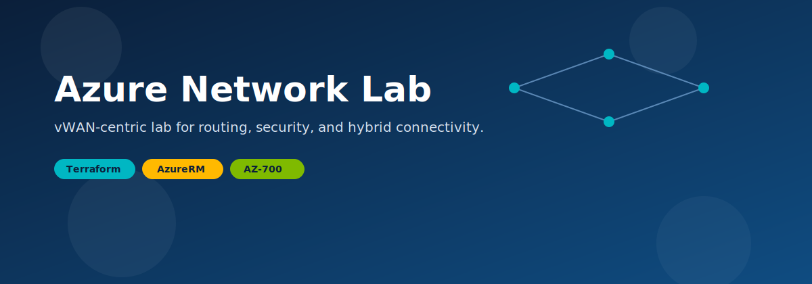
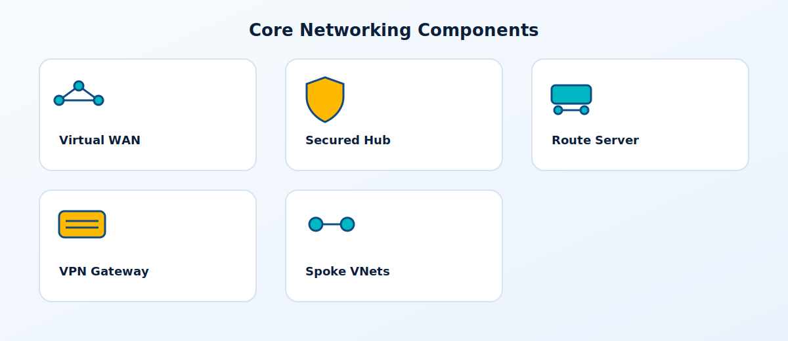
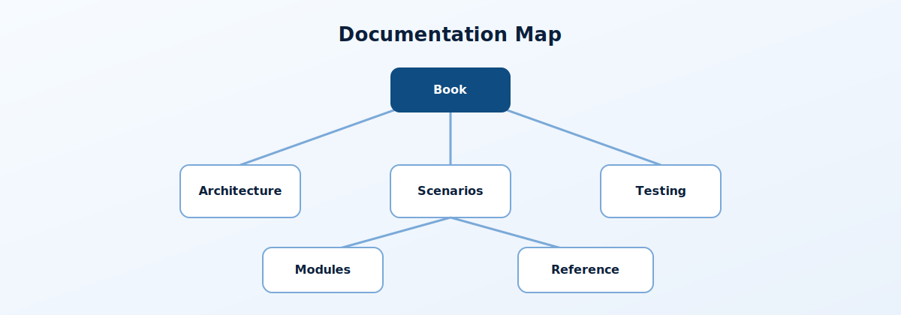
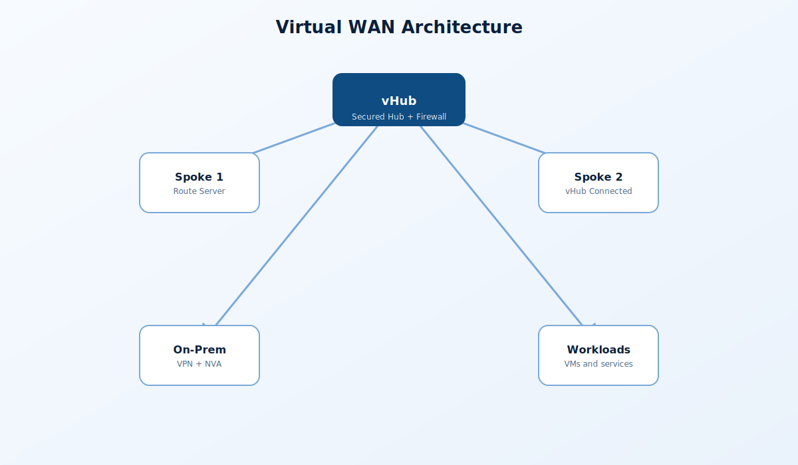
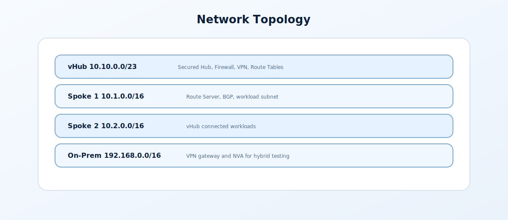

# 🌐 Azure Network Lab

```
███╗   ██╗███████╗████████╗██╗    ██╗ ██████╗ ██████╗ ██╗  ██╗
████╗  ██║██╔════╝╚══██╔══╝██║    ██║██╔═══██╗██╔══██╗██║ ██╔╝
██╔██╗ ██║█████╗     ██║   ██║ █╗ ██║██║   ██║██████╔╝█████╔╝ 
██║╚██╗██║██╔══╝     ██║   ██║███╗██║██║   ██║██╔══██╗██╔═██╗ 
██║ ╚████║███████╗   ██║   ╚███╔███╔╝╚██████╔╝██║  ██║██║  ██╗
╚═╝  ╚═══╝╚══════╝   ╚═╝    ╚══╝╚══╝  ╚═════╝ ╚═╝  ╚═╝╚═╝  ╚═╝

                    __    ___    ____
                   / /   /   |  / __ )
                  / /   / /| | / __  |
                 / /___/ ___ |/ /_/ /
                /_____/_/  |_/_____/
          A Z U R E   N E T W O R K   L A B

            ☁️ AZURE NETWORK LAB ☁️
         ╔══════════════════════════════════╗
         ║          [ VIRTUAL WAN ]         ║
         ║     🔥 Firewall    🌐 VPN        ║
         ╚════╦══════════════════╦══════════╝
              ║                  ║
        ╔═════╩════╗       ╔═════╩════╗
        ║  SPOKE1  ║       ║  SPOKE2  ║
        ║Route Srv ║       ║  vHub    ║
        ╚══════════╝       ╚══════════╝
```

[](https://terraform.io)
[](https://azure.microsoft.com)
[](LICENSE)

<p align="center">
  
</p>

<p align="center">
  
</p>


Learn Azure networking the right way—by building it. This Terraform project deploys a complete **vWAN-centric networking environment** you can explore, break, and rebuild. Covers Virtual WAN, Secured Hub, VPN connectivity, Route Server, and spoke networks following Microsoft best practices.

> 💡 **Hands-on Learning**: Deploy real enterprise network infrastructure in minutes. Perfect for **AZ-700 certification prep**, team training, or validating network architectures before production.

## 🧭 Master Control Panel (feature toggles)

The lab is driven by the `deploy` object in `terraform.tfvars`. Flip the flags to change the footprint, then run `terraform plan` and `terraform apply`.

> Note: When `deploy.route_server = true`, Spoke1 is not connected to vHub (Azure limitation).

---

## 📋 Table of Contents

- [Overview](#-overview)
- [Documentation](#-documentation)
- [Architecture Diagram](#-architecture-diagram)
- [What Gets Deployed](#-what-gets-deployed)
- [Network Topology](#-network-topology)
- [Quick Start](#-quick-start)
- [Feature Toggles](#-feature-toggles)
- [Configuration Options](#-configuration-options)
- [Cost Estimation](#-cost-estimation)
- [Project Structure](#-project-structure)
- [License](#-license)

---

## 🎯 Overview

This lab deploys a **Virtual WAN-centric architecture** with:

| Component | Purpose |
|-----------|---------|
| **Virtual WAN + Hub** | Global transit connectivity |
| **Secured Hub (Azure Firewall)** | Centralized security inspection |
| **vHub VPN Gateway** | Branch connectivity |
| **Spoke VNets** | Workload isolation |
| **Route Server** | BGP route injection |
| **Simulated On-Premises** | VPN testing |

---

## 📚 Documentation

<p align="center">
  
</p>


The full wiki lives in `wiki/` and mirrors the style of the Azure Landing Zone lab.

- Start here: `wiki/README.md`
- Deep dive guide: `wiki/book.md`
- Architecture: `wiki/architecture/overview.md`
- Scenarios: `wiki/scenarios/README.md`
- Testing: `wiki/testing/lab-testing-guide.md`

---

## 🏛️ Architecture Diagram

<p align="center">
  
</p>


```
┌─────────────────────────────────────────────────────────────────────────────┐
│                              VIRTUAL WAN                                     │
│  ┌─────────────────────────────────────────────────────────────────────────┐│
│  │                          VIRTUAL HUB (10.10.0.0/23)                     ││
│  │  ┌─────────────┐  ┌─────────────┐  ┌─────────────┐                      ││
│  │  │   Azure     │  │  vHub VPN   │  │   Route     │                      ││
│  │  │  Firewall   │  │   Gateway   │  │   Tables    │                      ││
│  │  │  (Secured)  │  │   (BGP)     │  │             │                      ││
│  │  └──────┬──────┘  └──────┬──────┘  └─────────────┘                      ││
│  │         │                │                                               ││
│  └─────────┼────────────────┼───────────────────────────────────────────────┘│
│            │                │                                                │
└────────────┼────────────────┼────────────────────────────────────────────────┘
             │                │
    ┌────────┴────────┐       │         ┌─────────────────────────┐
    │                 │       │         │                         │
    ▼                 ▼       ▼         ▼                         │
┌─────────────────┐ ┌─────────────────┐ ┌─────────────────┐       │
│   SPOKE 1       │ │   SPOKE 2       │ │   ON-PREM       │       │
│  10.1.0.0/16    │ │  10.2.0.0/16    │ │ 192.168.0.0/16  │       │
│                 │ │                 │ │                 │       │
│ ┌─────────────┐ │ │ ┌─────────────┐ │ │ ┌─────────────┐ │       │
│ │Route Server │ │ │ │ Workload VM │ │ │ │ VPN Gateway │◄┼───────┘
│ │   (BGP)     │ │ │ └─────────────┘ │ │ │   (BGP)     │ │  S2S VPN
│ └──────┬──────┘ │ │                 │ │ └─────────────┘ │
│        │        │ │  vHub Connected │ │                 │
│ ┌──────▼──────┐ │ │                 │ │ ┌─────────────┐ │
│ │  NVA (RRAS) │ │ │                 │ │ │ NVA (RRAS)  │ │
│ │  ASN 65501  │ │ │                 │ │ └─────────────┘ │
│ └─────────────┘ │ │                 │ │                 │
│                 │ │                 │ │ ┌─────────────┐ │
│ ┌─────────────┐ │ │                 │ │ │ Workload VM │ │
│ │Workload VMs │ │ │                 │ │ └─────────────┘ │
│ │ (LB Pool)   │ │ │                 │ │                 │
│ └─────────────┘ │ │                 │ │                 │
└─────────────────┘ └─────────────────┘ └─────────────────┘
   Route Server        vHub Connected     VPN S2S to vHub
   (No vHub Conn)
```

---

## 📦 What Gets Deployed

### Core Infrastructure

| Resource | Name | Purpose |
|----------|------|---------|
| Resource Group | `rg-az700-lab` | Container for all resources |
| Virtual WAN | `vwan-az700-lab` | Global WAN fabric |
| Virtual Hub | `vhub-az700-lab` | Regional hub (10.10.0.0/23) |
| Azure Firewall | `fw-vhub-az700-lab` | Secured Hub with firewall |
| vHub VPN Gateway | `vpngw-vhub-az700-lab` | Branch VPN termination |

### Virtual Networks

| VNet | Address Space | Purpose |
|------|---------------|---------|
| **Spoke1** | 10.1.0.0/16 | Route Server + NVA testing |
| **Spoke2** | 10.2.0.0/16 | Standard vHub connectivity |
| **OnPrem** | 192.168.0.0/16 | Simulated on-premises |

### Virtual Machines

| VM | Location | Purpose |
|----|----------|---------|
| vm-spoke1-1 | Spoke1 | Workload (LB backend) |
| vm-spoke1-2 | Spoke1 | Workload (LB backend) |
| vm-spoke1-nva | Spoke1 | RRAS NVA for Route Server BGP |
| vm-spoke2-1 | Spoke2 | Workload |
| vm-onprem-1 | OnPrem | Simulated on-prem workload |
| vm-onprem-nva | OnPrem | RRAS NVA |

### Optional Components

| Component | Variable | Default |
|-----------|----------|---------|
| Azure Bastion | `deploy.bastion` | `false` |
| Application Gateway (WAF) | `deploy.application_gateway` | `false` |
| DNS Private Resolver | `deploy.dns_resolver` | `true` |
| NAT Gateway | `deploy.nat_gateway` | `true` |
| Route Server | `deploy.route_server` | `true` |

---

## 🌐 Network Topology

<p align="center">
  
</p>


### Address Space Allocation

| Network | CIDR | Purpose |
|---------|------|---------|
| **Virtual Hub** | 10.10.0.0/23 | vWAN Hub |
| **Spoke 1** | 10.1.0.0/16 | Route Server testing |
| ├─ Workload | 10.1.1.0/24 | VMs |
| ├─ NvaSubnet | 10.1.8.0/24 | NVA (10.1.8.10) |
| ├─ RouteServerSubnet | 10.1.7.0/27 | Route Server |
| └─ Other subnets | 10.1.x.0/24 | LB, AppGw, PE, DNS, Bastion |
| **Spoke 2** | 10.2.0.0/16 | vHub connected |
| └─ Workload | 10.2.1.0/24 | VMs |
| **On-Premises** | 192.168.0.0/16 | Simulated on-prem |
| ├─ Default | 192.168.1.0/24 | VMs |
| ├─ NvaSubnet | 192.168.2.0/24 | NVA (192.168.2.10) |
| └─ GatewaySubnet | 192.168.0.0/27 | VPN Gateway |

---

## 🚀 Quick Start

### Prerequisites

- Azure subscription with Owner or Contributor rights
- Terraform 1.9 or later
- Azure CLI signed in (`az login`)

### Deploy

```bash
# Clone the repository
git clone https://github.com/Jamonygr/azure-network-lab.git
cd azure-network-lab

# Copy and edit variables
cp terraform.tfvars.example terraform.tfvars
# Edit terraform.tfvars with your values

# Initialize and deploy
terraform init
terraform plan -out=tfplan
terraform apply tfplan
```

### Destroy

```bash
terraform destroy -auto-approve
```

---

## 🎛️ Feature Toggles

Control what gets deployed to optimize costs:

```hcl
# terraform.tfvars

# Feature Toggles
deploy = {
  vwan          = true   # Virtual WAN
  vhub_firewall = true   # Azure Firewall in vHub (~$912/mo)
  vpn           = false  # VPN Gateways (vHub + OnPrem)
  route_server  = true   # Azure Route Server (~$360/mo)

  dns_resolver      = true   # DNS Private Resolver (~$180/mo)
  private_dns_zones = true   # Private DNS Zones
  bastion           = false  # Azure Bastion (~$140/mo)

  application_gateway = false # WAF v2 (~$250/mo)
  load_balancer       = true  # Internal Load Balancer
  nat_gateway         = true  # NAT Gateway (~$45/mo)

  private_endpoint = true   # Storage Account + Private Endpoint

  spoke1_vms = true   # VMs in Spoke1 VNet
  spoke2_vms = true   # VMs in Spoke2 VNet
  onprem_vms = false  # VMs in OnPrem VNet
  nvas       = true   # Network Virtual Appliances (RRAS/BGP)
}
```

> **Note**: When `deploy.route_server = true`, Spoke1 does NOT connect to vHub (Azure limitation: VNet cannot have both Route Server and vHub remote gateway).

---

## ⚙️ Configuration Options

### Essential Variables

```hcl
# terraform.tfvars

# Required
subscription_id = "your-subscription-id"
admin_username  = "azureadmin"
admin_password  = "YourSecureP@ssw0rd!"
vpn_shared_key  = "YourVPNSharedKey123!"

# Optional
ctx = {
  project  = "az700-lab"
  location = "eastus2"
  tags = {
    Environment = "lab"
    Project     = "az700"
  }
}
vm_size = "Standard_B2s"
```

### Network Configuration

```hcl
# Address Spaces
vhub_address_prefix  = "10.10.0.0/23"
spoke1_address_space = ["10.1.0.0/16"]
spoke2_address_space = ["10.2.0.0/16"]
onprem_address_space = ["192.168.0.0/16"]
```

---

## 💰 Cost Estimation

### Monthly Cost by Component

| Component | Estimated Cost | Notes |
|-----------|----------------|-------|
| Azure Firewall (Standard) | ~$350/mo | Always on |
| vHub VPN Gateway | ~$140/mo | Scale unit 1 |
| OnPrem VPN Gateway (VpnGw1) | ~$140/mo | For S2S VPN |
| Route Server | ~$360/mo | Optional |
| Application Gateway (WAF_v2) | ~$250/mo | Optional |
| DNS Private Resolver | ~$180/mo | Optional |
| NAT Gateway | ~$45/mo | Optional |
| Azure Bastion (Basic) | ~$140/mo | Optional |
| VMs (6x Standard_B2s) | ~$150/mo | Windows Server Core |
| Storage, IPs, etc. | ~$50/mo | Miscellaneous |

### Cost Profiles

| Profile | Components | Est. Monthly |
|---------|------------|--------------|
| **Minimal** | vWAN + Firewall + VPN + VMs | ~$800 |
| **Standard** | + Route Server + NAT + DNS | ~$1,400 |
| **Full** | + AppGw + Bastion | ~$1,800 |

---

## 📁 Project Structure

```
azure-network-lab/
├── README.md                  # This documentation
├── LICENSE                    # MIT License
├── main.tf                    # Root orchestration (lab only)
├── variables.tf               # Input variables
├── outputs.tf                 # Output values
├── locals.tf                  # Computed locals
├── moved.tf                  # State move declarations
├── providers.tf               # Provider configuration
├── terraform.tfvars           # Your configuration (gitignored)
├── terraform.tfvars.example   # Example configuration
├── wiki/                      # Documentation wiki
│
└── modules/                   # Reusable modules
    ├── application-gateway/
    ├── bastion/
    ├── dns-private-resolver/
    ├── load-balancer/
    ├── local-network-gateway/
    ├── log-analytics/
    ├── nat-gateway/
    ├── nsg/
    ├── private-dns-zone/
    ├── private-endpoint/
    ├── resource-group/
    ├── route-server/
    ├── storage-account/
    ├── tags/
    ├── vhub/
    ├── vhub-connection/
    ├── vhub-firewall/
    ├── vhub-vpn-gateway/
    ├── vm-windows/
    ├── vm-windows-nva/
    ├── vnet/
    ├── vnet-peering/
    ├── vpn-connection/
    ├── vpn-gateway/
    ├── vpn-site/
    └── vwan/
```

### Deployment Phases

| Phase | Components |
|-------|------------|
| 1. Foundation | Resource Group, Log Analytics |
| 2. vWAN Core | vWAN, vHub, Firewall, VPN Gateway |
| 3. Virtual Networks | Spoke1, Spoke2, OnPrem VNets |
| 4. NSGs | Network Security Groups |
| 5. vHub Connections | Spoke connections to hub |
| 6. VPN Infrastructure | OnPrem VPN, Site, Connection |
| 7. Route Server | Optional Route Server |
| 8. DNS | Private DNS Zones, Resolver |
| 9. Compute Support | LB, App GW, NAT GW, Bastion |
| 10. Private Endpoints | Storage, PE |
| 11. VMs | Workload VMs |
| 12. NVAs | RRAS Network Virtual Appliances |

---

## 🧪 Lab Scenarios

This environment supports the following AZ-700 exam topics:

| Scenario | Components Used |
|----------|-----------------|
| **Virtual WAN Configuration** | vWAN, vHub, Hub Connections |
| **Secured Virtual Hub** | Azure Firewall in vHub |
| **VPN Site-to-Site** | vHub VPN GW, OnPrem VPN GW, VPN Site |
| **BGP Routing** | VPN with BGP, Route Server |
| **Route Server + NVA** | Route Server, RRAS NVA, BGP Peering |
| **Private DNS** | Private DNS Zones, VNet Links |
| **Private Endpoints** | Storage PE, Private DNS Integration |
| **Load Balancing** | Internal Load Balancer |
| **Application Gateway** | WAF v2 |
| **DNS Resolution** | DNS Private Resolver |

---

## 📄 License

This project is licensed under the MIT License - see the [LICENSE](LICENSE) file for details.

---

## 🙏 Acknowledgments

- [Microsoft Cloud Adoption Framework](https://docs.microsoft.com/azure/cloud-adoption-framework/)
- [Azure Virtual WAN](https://docs.microsoft.com/azure/virtual-wan/)
- [AZ-700 Exam Guide](https://docs.microsoft.com/learn/certifications/exams/az-700)
- [Terraform Azure Provider](https://registry.terraform.io/providers/hashicorp/azurerm/latest)

---

**Built with ❤️ for learning Azure networking**

*Last Updated: December 2024*
