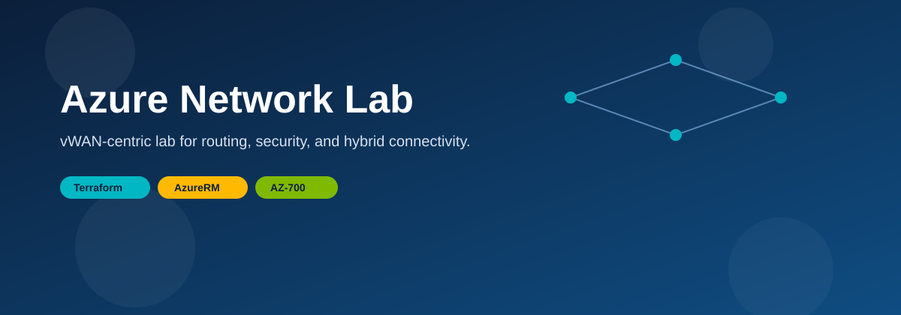
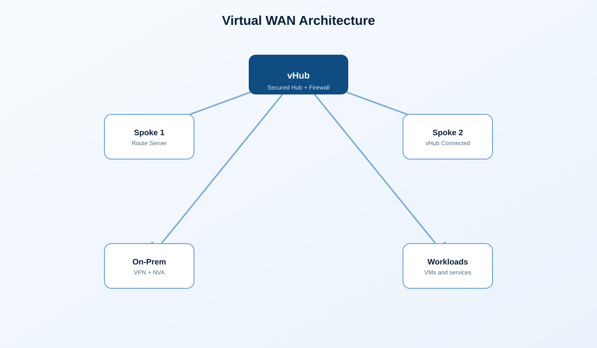

# Azure Network Lab

[](https://terraform.io)
[](https://registry.terraform.io/providers/hashicorp/azurerm/latest)
[](LICENSE)

Azure Network Lab is a Terraform-based Azure networking environment for learning, demos, and architecture validation. It builds a Virtual WAN-centered topology with optional secured hub, VPN, Route Server, private DNS, private endpoints, load balancing, and edge services.

The lab is designed to be modular, switchable, and easy to tear down. Use the `deploy` object in `terraform.tfvars` to choose a low-cost learning footprint or a fuller hybrid networking scenario.

<p align="center">
  
</p>

## What This Lab Demonstrates

| Area | Capabilities |
|------|--------------|
| Transit networking | Azure Virtual WAN, Virtual Hub, spoke connectivity |
| Security | Secured hub with Azure Firewall, NSGs, private access patterns |
| Hybrid connectivity | Site-to-site VPN, VPN Gateway, VPN Site, BGP settings |
| Routing | Azure Route Server, RRAS-based NVA, BGP peering patterns |
| DNS and private access | Private DNS zones, DNS Private Resolver, Private Endpoint |
| Edge services | Internal Load Balancer, Application Gateway WAF, NAT Gateway, Bastion |
| Operations | Validation guides, testing matrix, cost model, hardening checklist |

## Architecture

<p align="center">
  
</p>

Core topology:

- One Azure Virtual WAN and regional Virtual Hub.
- Two spoke VNets for workload and routing scenarios.
- One simulated on-premises VNet for VPN and BGP testing.
- Optional Azure Firewall in the Virtual Hub.
- Optional Route Server in Spoke1 with an RRAS NVA peer.
- Optional DNS Private Resolver, Private Endpoint, NAT Gateway, Bastion, Load Balancer, and Application Gateway.

Important platform note: when `deploy.route_server = true`, Spoke1 is not connected to the Virtual Hub because a VNet cannot use both Azure Route Server and a Virtual Hub remote gateway connection in this topology.

## Quick Start

Prerequisites:

- Azure subscription with permissions to create networking, compute, and monitoring resources.
- Terraform 1.9 or later.
- Azure CLI authenticated with `az login`.

```bash
git clone https://github.com/Jamonygr/azure-network-lab.git
cd azure-network-lab

cp terraform.tfvars.example terraform.tfvars
```

Edit `terraform.tfvars`:

```hcl
subscription_id = "00000000-0000-0000-0000-000000000000"

ctx = {
  project  = "az700-lab"
  location = "eastus2"
  tags = {
    Owner       = "Your Name"
    CostCenter  = "Training"
    Environment = "lab"
    Project     = "az700"
  }
}

admin_username = "azureadmin"
admin_password = "Use-A-Strong-Unique-Password!"
vpn_shared_key = "Use-A-Strong-Unique-Key!"
```

Deploy:

```bash
terraform init
terraform fmt -recursive
terraform validate
terraform plan -out=tfplan
terraform apply tfplan
```

Clean up:

```bash
terraform destroy
```

## Deployment Profiles

The repository does not require separate branches for different lab shapes. Change the `deploy` object in `terraform.tfvars` and run a new plan.

| Profile | Suggested toggles | Use case |
|---------|-------------------|----------|
| Minimal | Disable VPN, Bastion, Application Gateway, and on-prem VMs | Lower-cost topology exploration |
| Routing | Enable Route Server and NVAs | BGP and route propagation practice |
| Hybrid | Enable VPN, vHub VPN Gateway, on-prem VMs, and NVAs | Site-to-site connectivity testing |
| Full | Enable all optional services | End-to-end scenario walkthrough |

Cost-bearing services include Azure Firewall, Route Server, VPN Gateways, DNS Private Resolver, Application Gateway, Bastion, NAT Gateway, and VMs. Review [wiki/reference/cost-model.md](wiki/reference/cost-model.md) before applying a full profile.

## Feature Toggles

```hcl
deploy = {
  vwan          = true
  vhub_firewall = true
  vpn           = false
  route_server  = true

  dns_resolver      = true
  private_dns_zones = true
  bastion           = false

  application_gateway = false
  load_balancer       = true
  nat_gateway         = true

  private_endpoint = true

  spoke1_vms = true
  spoke2_vms = true
  onprem_vms = false
  nvas       = true
}
```

## Validation

Local validation:

```bash
terraform fmt -check -recursive
terraform init -backend=false
terraform validate
```

Post-deployment validation:

- Start with [docs/operations/deployment-checklist.md](docs/operations/deployment-checklist.md).
- Run the component checks in [wiki/testing/lab-testing-guide.md](wiki/testing/lab-testing-guide.md).
- Use [wiki/testing/test-matrix.md](wiki/testing/test-matrix.md) to validate only the features you enabled.

The GitHub workflow in [.github/workflows/terraform-validate.yml](.github/workflows/terraform-validate.yml) checks formatting, initializes Terraform without a backend, validates the configuration, and blocks tracked local Terraform artifacts.

## Documentation

| Start here | Purpose |
|------------|---------|
| [wiki/README.md](wiki/README.md) | Full documentation map |
| [wiki/book.md](wiki/book.md) | Guided walkthrough |
| [wiki/architecture/overview.md](wiki/architecture/overview.md) | Architecture overview |
| [wiki/scenarios/README.md](wiki/scenarios/README.md) | Hands-on scenarios |
| [wiki/testing/lab-testing-guide.md](wiki/testing/lab-testing-guide.md) | Test and verification steps |
| [wiki/reference/hardening.md](wiki/reference/hardening.md) | Hardening checklist |
| [CONTRIBUTING.md](CONTRIBUTING.md) | Contribution workflow |
| [SECURITY.md](SECURITY.md) | Secret handling and cloud safety guidance |

## Project Structure

```text
azure-network-lab/
|-- .github/workflows/          # Terraform validation automation
|-- docs/
|   |-- images/                 # README architecture images
|   `-- operations/             # Deployment and review checklists
|-- modules/                    # Reusable Terraform modules
|-- wiki/                       # Architecture, scenarios, testing, and reference docs
|-- main.tf                     # Root orchestration
|-- locals.tf                   # Topology maps, feature filters, derived values
|-- variables.tf                # Inputs and validations
|-- outputs.tf                  # Deployment outputs
|-- providers.tf                # Terraform and provider requirements
`-- terraform.tfvars.example    # Copy to terraform.tfvars for local use
```

## Safety Notes

- Do not commit `terraform.tfvars`, state files, plan files, logs, or generated credentials.
- Prefer short-lived lab deployments and run `terraform destroy` when finished.
- Use unique VM admin passwords and VPN shared keys for each deployment.
- Review NSG and firewall rules before adapting this lab beyond isolated learning environments.
- Use remote state with encryption, versioning, soft delete, and locking for shared work.

## License

This project is licensed under the [MIT License](LICENSE).

## Acknowledgments

- [Microsoft Cloud Adoption Framework](https://learn.microsoft.com/azure/cloud-adoption-framework/)
- [Azure Virtual WAN documentation](https://learn.microsoft.com/azure/virtual-wan/)
- [AZ-700 exam guide](https://learn.microsoft.com/credentials/certifications/exams/az-700/)
- [Terraform AzureRM Provider](https://registry.terraform.io/providers/hashicorp/azurerm/latest)
