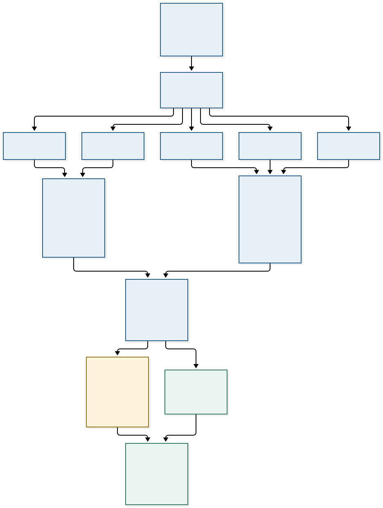

# Azure Network Lab

A Terraform learning repository for **AZ-700: Azure Networking**, aligned to the skills effective **27 July 2026**. Start with a small network-only profile, then study isolated routing, private access, delivery, and security configurations.

**Azure deployment and live tests: NOT RUN.** This update is authored and checked locally. Diagrams show intended configurations, and example evidence is explicitly synthetic. See [validation status](docs/validation-status.md) for the checks actually completed.



*Read by exam domain, then select one configuration. A configuration is not proof that Azure accepted it or that traffic passed.*

## Start here

1. Read the [five-domain book](wiki/book.md) and [objective coverage matrix](wiki/reference/az-700-alignment.md).
2. Inspect [profiles/minimal.tfvars.example](profiles/minimal.tfvars.example). The default excludes VMs, gateways, Firewall, Route Server, resolver endpoints, and other optional paid services.
3. Review [costs](wiki/reference/cost-model.md), [state isolation](wiki/reference/state-and-secrets.md), and the [local checks](wiki/testing/lab-testing-guide.md).
4. Choose a [scenario](wiki/scenarios/README.md). Future Azure commands are reference instructions only; they were not executed for this update.

Toolchain: **Terraform 1.16.4**, **AzureRM 4.57.0**, and **PowerShell 7+ (7.4+ recommended)** for local tooling. The runner validates an isolated source-only copy; provider downloads can require Internet access.

```powershell
pwsh ./scripts/Test-Offline.ps1
```

Do not run an ordinary Terraform plan as a substitute for offline validation: providers may authenticate, refresh resources, or perform data lookups. Mocked tests must use the supplied test definitions. [Testing guide](wiki/testing/lab-testing-guide.md)

## Choose a footprint

| Root profile | Purpose | Main cost drivers if a reader later deploys it |
|---|---|---|
| [minimal](profiles/minimal.tfvars.example) | Address spaces, service subnets, NSGs and spoke peering | Network-only starter; adding services changes the footprint |
| [vwan-secured](profiles/vwan-secured.tfvars.example) | Hub connections, Firewall policy and routing intent | vHub, Firewall, processing |
| [hybrid-vpn](profiles/hybrid-vpn.tfvars.example) | Azure-hosted branch simulation and vWAN VPN | Two gateway types, vHub, traffic |
| [route-server](profiles/route-server.tfvars.example) | BGP control plane and RRAS NVA | Route Server, NVAs, disks, outbound service |
| [private-dns](profiles/private-dns.tfvars.example) | Resolver, private zones and Blob private endpoint | Resolver endpoints, private endpoint, storage |
| [application-delivery](profiles/application-delivery.tfvars.example) | Standard internal LB and Application Gateway WAF_v2 | App Gateway, two required backend VMs, outbound |
| [legacy-combined](profiles/legacy-combined.tfvars.example) | Review the earlier combined teaching topology | Multiple services; never the starter |

Profiles apply to the same root and **do not create separate state automatically**. Use a separate checkout/directory and state per concurrent profile. Switching a profile in existing state can remove resources. The legacy configuration omits Spoke1's vHub connection when Route Server is enabled; that omission prevents an unsupported combination. [Architecture](wiki/architecture/overview.md)

## Independent examples

Each example is a separate Terraform root with its own README, input file, and state. It does not consume the main root's state.

| Example | Learning focus |
|---|---|
| [AVNM](examples/avnm/README.md) | Network groups, connectivity, security admin rules, routing |
| [Front Door private origin](examples/front-door-private-origin/README.md) | Premium, WAF, App Service origin, Private Link approval |
| [Traffic Manager](examples/traffic-manager/README.md) | DNS routing and endpoint health across two regions |
| [Private Link service](examples/private-link-service/README.md) | Producer load balancer, consumer endpoint, private DNS |
| [Service endpoint policy](examples/service-endpoint-policy/README.md) | Storage destination restriction with separate data permissions |
| [Point-to-site VPN](examples/point-to-site-vpn/README.md) | OpenVPN, Entra authentication and client boundaries |
| [DDoS protection](examples/ddos-protection/README.md) | Opt-in protection plan and monitoring; no attack generation |

ExpressRoute, BYOIP, a third-party Gateway Load Balancer appliance, external VPN equipment, and Defender investigations have [design exercises](wiki/scenarios/design-exercises.md). Their presence in the curriculum does not claim deployment coverage.

## Documentation and contribution

- [Wiki navigation](wiki/README.md) · [Architecture](wiki/architecture/overview.md) · [Scenarios](wiki/scenarios/README.md)
- [Generated interfaces](reference/README.md) · [Variables](wiki/reference/variables.md) · [Lifecycle changes](wiki/reference/defaults-and-skus.md) · [Troubleshooting](wiki/testing/troubleshooting.md)
- [Contributing](CONTRIBUTING.md) · [Security](SECURITY.md) · [MIT license](LICENSE)

The [official Microsoft study guide](https://learn.microsoft.com/en-us/credentials/certifications/resources/study-guides/az-700) remains the exam authority. This repository is a teaching aid, not a claim of exam completeness or production readiness.
