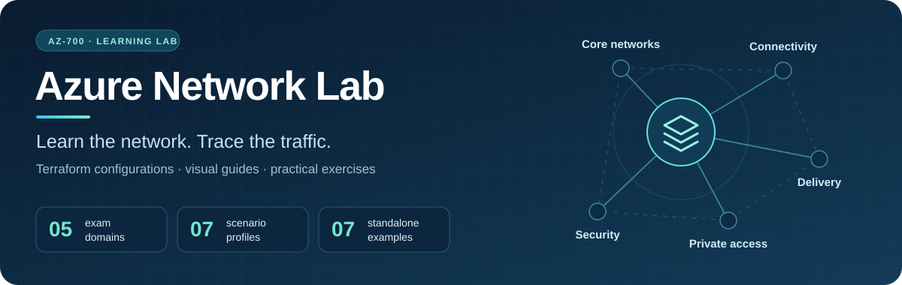

<p align="center">
  
</p>

# Azure Network Lab

Explore Azure networking with **Terraform, diagrams, and guided exercises**. AZ-700 skills baseline: **27 July 2026**.

**[Start learning →](wiki/book.md)** · **[Choose a lab](#choose-a-footprint)** · **[Browse the wiki](wiki/README.md)** · **[Objective map](wiki/reference/az-700-alignment.md)**

## Start here

Start with [minimal](profiles/minimal.tfvars.example): three VNets, subnets, NSGs, and spoke peering. No VM password or VPN secret; paid services stay opt-in.



*The starter reserves service subnets; their names do not enable the services.*

**Local checks:** Terraform `1.16.4` · AzureRM `4.57.0` · PowerShell `7+` · [All prerequisites](wiki/testing/lab-testing-guide.md)

```powershell
pwsh ./scripts/Test-Offline.ps1
```

## Learn by exam domain

| Domain | Explore |
|---|---|
| 🌐 **Core networking** | [VNets, addressing, DNS, routing, and monitoring](wiki/domains/01-core.md) |
| 🔗 **Connectivity** | [VPN, Virtual WAN, Route Server, and ExpressRoute design](wiki/domains/02-connectivity.md) |
| ⚖️ **Application delivery** | [Load Balancer, Application Gateway, Front Door, and Traffic Manager](wiki/domains/03-delivery.md) |
| 🔒 **Private access** | [Private endpoints, Private Link service, and service endpoints](wiki/domains/04-private-access.md) |
| 🛡️ **Network security** | [NSGs, Firewall, WAF, DDoS, and Defender design](wiki/domains/05-security.md) |

[136 mapped objectives](wiki/reference/az-700-alignment.md): Terraform-backed, reference configuration, or design exercise.

## Choose a footprint

[Scenario guides](wiki/scenarios/README.md) · [Cost planning](wiki/reference/cost-model.md)

| Profile | What you explore |
|---|---|
| **[minimal](profiles/minimal.tfvars.example)** — start here | Address spaces, subnets, NSGs, and spoke peering |
| [vwan-secured](profiles/vwan-secured.tfvars.example) | Managed hub, Firewall policy, and routing intent |
| [hybrid-vpn](profiles/hybrid-vpn.tfvars.example) | Azure-hosted branch simulation and vWAN VPN |
| [route-server](profiles/route-server.tfvars.example) | BGP route exchange and RRAS network virtual appliances |
| [private-dns](profiles/private-dns.tfvars.example) | DNS Private Resolver, private zones, and a Blob private endpoint |
| [application-delivery](profiles/application-delivery.tfvars.example) | Internal Load Balancer, Application Gateway WAF, and two web VMs |
| [legacy-combined](profiles/legacy-combined.tfvars.example) | The earlier combined teaching topology |

Use [separate state](wiki/reference/state-and-secrets.md) per concurrent profile. Switching profiles in existing state can remove resources.

### See the traffic paths

<details>
<summary><strong>🌐 Secured Virtual WAN — hub routing and Firewall</strong></summary>



[Follow the secured-hub exercise →](wiki/scenarios/secured-hub-firewall.md)

</details>

<details>
<summary><strong>🔀 Route Server — BGP control plane and NVA data path</strong></summary>



[Follow the BGP exercise →](wiki/scenarios/route-server-bgp.md)

</details>

Separate scenarios. [More architecture diagrams →](docs/diagrams/README.md)

## Independent examples

Separate Terraform roots, each with its own guide and local state.

| 🌐 Connect and route | 🔒 Protect and isolate |
|---|---|
| [Virtual Network Manager](examples/avnm/README.md) — groups and network policies | [Private Link service](examples/private-link-service/README.md) — provider and consumer |
| [Front Door Premium](examples/front-door-private-origin/README.md) — WAF and private origin | [Service endpoint policy](examples/service-endpoint-policy/README.md) — restricted Storage access |
| [Traffic Manager](examples/traffic-manager/README.md) — health and DNS routing | [DDoS protection](examples/ddos-protection/README.md) — opt-in plan and monitoring |
| [Point-to-site VPN](examples/point-to-site-vpn/README.md) — OpenVPN and Entra ID | [Design exercises](wiki/scenarios/design-exercises.md) — externally dependent topics |

## Validation and reference

**Local validation passed · Azure deployment and live tests: NOT RUN.** [Results and scope →](docs/validation-status.md)

[Terraform reference](reference/README.md) · [Variables](wiki/reference/variables.md) · [Troubleshooting](wiki/testing/troubleshooting.md) · [Contributing](CONTRIBUTING.md) · [Security](SECURITY.md) · [MIT license](LICENSE)

Exam scope: [official Microsoft AZ-700 study guide](https://learn.microsoft.com/en-us/credentials/certifications/resources/study-guides/az-700).
