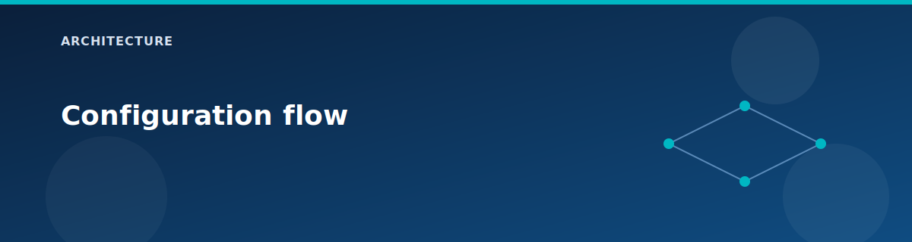

# Configuration flow

<p align="center">
  
</p>


This page shows how values move from inputs to resources. Understanding this flow makes it easier to add or remove services without breaking dependencies.

## 1) Inputs

`terraform.tfvars` defines the lab profile:

- Subscription ID and `ctx` (project, location, tags).
- `deploy` feature flags.
- Address spaces, VM settings, and VPN shared key.

## 2) Locals

`locals.tf` builds the data model for `for_each`:

- Naming prefix (`local.prefix`).
- Required and default tags (`local.required_tag_keys`, `local.default_tags`).
- VNet, subnet, and NSG maps.
- VM and NVA maps with `enabled` flags.
- Filtered maps that drive optional resources.

Example pattern:

```hcl
vm_windows_enabled = { for k, v in local.vm_windows : k => v if v.enabled }
```

## 3) Modules

`main.tf` instantiates modules in a predictable order:

- Foundation: `resource-group`, `log-analytics`.
- Core network: `vwan`, `vhub`, `vhub-firewall`, `vhub-vpn-gateway`.
- Spokes: `vnet`, `nsg`, `vnet-peering`.
- Connectivity: `vhub-connection`, `vpn-site`, `vpn-connection`.
- Services: `route-server`, `dns-private-resolver`, `private-dns-zone`.
- Compute: `vm-windows`, `vm-windows-nva`.

## 4) Outputs

`outputs.tf` exposes IPs and IDs for testing, along with a `connection_info` map for quick access.

## Key toggle behaviors

- `deploy.route_server`: enables Route Server and NVA BGP, disables Spoke1 vHub connection.
- `deploy.vpn`: enables both the vHub VPN Gateway and the on-prem VPN gateway.
- `deploy.private_endpoint`: creates storage + private endpoint; requires `deploy.private_dns_zones`.

## Example flow: Route Server

1. `deploy.route_server = true` creates Route Server in Spoke1.
2. NVA module receives Route Server IPs and BGP ASN.
3. Custom Script extension configures RRAS and peers.
4. Spoke1 vHub connection is disabled to avoid conflicts.

## Related pages

- `architecture/routing-and-bgp.md`
- `modules/README.md`
- [Variables reference](../reference/variables.md)
- [Outputs reference](../reference/outputs.md)
- [Terraform patterns](../reference/terraform-patterns.md)
- [Architecture overview](overview.md)

