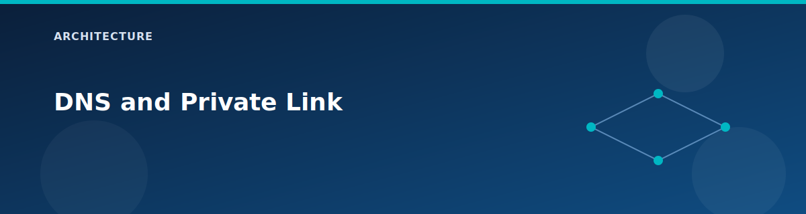

# DNS and Private Link

<p align="center">
  
</p>


This lab includes private DNS zones, a DNS Private Resolver, and a storage private endpoint so you can practice private name resolution end-to-end.

## Components

- Private DNS zone: `lab.internal` with auto-registration enabled.
- Private DNS zone: `privatelink.blob.core.windows.net` for storage.
- DNS Private Resolver with inbound and outbound endpoints in Spoke1.
- Private Endpoint for the storage account (blob subresource).

## VNet links

All VNets (Spoke1, Spoke2, OnPrem) are linked to private DNS zones. This allows private name resolution across the lab without custom DNS servers.

## Private Endpoint behavior

- Storage account public access is disabled by default.
- Private endpoint is created in the Spoke1 `PrivateEndpointSubnet`.
- A private DNS zone group associates the endpoint to the blob zone.

## Resolution flow

1. VM queries the storage account FQDN.
2. The private DNS zone returns a private IP.
3. Traffic flows over the private endpoint in Spoke1.

## Validation commands

```bash
# Zones and endpoints
az network private-dns zone list -g rg-<prefix> -o table
az network private-endpoint list -g rg-<prefix> -o table

# DNS resolution from a VM
az vm run-command invoke -g rg-<prefix> -n vm-spoke1-1 \
  --command-id RunPowerShellScript \
  --scripts "Resolve-DnsName <storage-account>.blob.core.windows.net"
```

## Limitations and extensions

- No DNS forwarding rules are configured by default.
- Only blob private endpoints are created in this lab.
- You can extend the resolver with forwarding rules or add more zones as needed.

## Related pages

- DNS validation: `testing/dns-validation.md`
- Testing: `testing/lab-testing-guide.md`
- Reference: `reference/ports-and-protocols.md`
- [Scenario: Private endpoints and DNS](../scenarios/private-endpoints-dns.md)
- [DNS validation](../testing/dns-validation.md)
- [Ports and protocols](../reference/ports-and-protocols.md)
- [Defaults and SKUs](../reference/defaults-and-skus.md)

