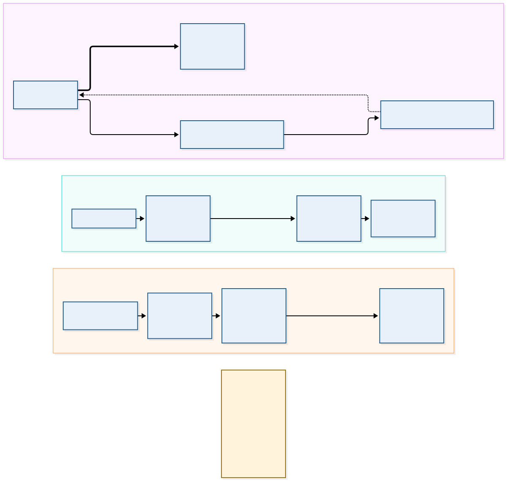

# DNS and Private Link

*Three separate cases show Azure Blob resolution, external-to-Azure forwarding, and Azure-to-branch forwarding. External DNS servers/private routes are reference dependencies; there is no loop connecting the cases.*

The root can create `lab.internal` and `privatelink.blob.core.windows.net`, VNet links, a Blob endpoint and zone association. The resolver profile creates dedicated inbound/outbound endpoint subnets. The forwarding inputs provide domain-specific rules and ruleset links.

Inbound DNS receives queries from a reachable external resolver. Outbound DNS sends matching queries to explicitly configured DNS servers. Creating an outbound endpoint without a rule and link does not complete hybrid forwarding. A link to a ruleset also does not create routing to a server. Avoid forwarding to your own inbound endpoint through a ruleset linked back into that endpoint's VNet: it can loop. [Resolver rules and endpoints](https://learn.microsoft.com/en-us/azure/dns/private-resolver-endpoints-rulesets)

For Blob, test the service's normal hostname and follow its CNAME chain rather than replacing application URLs with a private IP. TLS name validation and service routing still depend on the hostname.

DNS proves name resolution only. Pair it with endpoint approval, route, authorized data access and the intended public-access restriction. [Exercise](../scenarios/private-endpoints-dns.md) · [DNS diagnostics](../testing/dns-validation.md)
