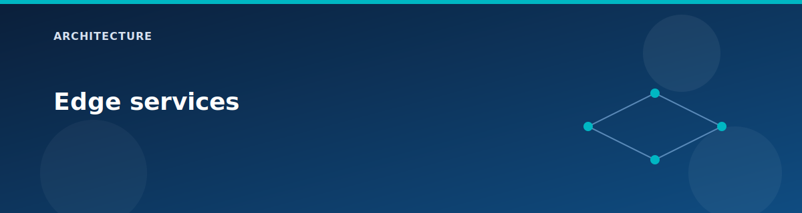

# Edge services

  

Edge services live in Spoke1 and are optional. They are intended for lab validation, not production workloads.

## Internal Load Balancer (ILB)

Created by `modules/load-balancer`:

- Standard internal load balancer.
- Frontend uses a dynamic private IP in `LoadBalancerSubnet`.
- HTTP probe on port 80 and a TCP rule for port 80.

## NAT Gateway

Created by `modules/nat-gateway`:

- Standard NAT gateway with static public IP.
- Associated to the Spoke1 Workload subnet.
- Zone 1 by default (module setting).

## Application Gateway

Created by `modules/application-gateway`:

- WAF_v2 SKU, capacity 1.
- Listener on HTTP port 80.
- WAF enabled in Detection mode.
- Backend pool is empty by default (add targets before testing).

## Bastion

Created by `modules/bastion`:

- Basic SKU by default.
- Public IP is standard and zone-redundant.
- Advanced features (tunneling, file copy) require Standard SKU.

## Validation hints

- Install IIS on workload VMs before testing ILB/App Gateway.
- Use outputs: `load_balancer_frontend_ip` and `application_gateway_public_ip`.

## Related pages

- Scenario: `scenarios/edge-services.md`
- Ports: `reference/ports-and-protocols.md`
- [Scenario: Edge services (LB, NAT, App Gateway, Bastion)](../scenarios/edge-services.md)
- [Defaults and SKUs](../reference/defaults-and-skus.md)
- [Security modules](../modules/security.md)
- [Networking modules](../modules/networking.md)

