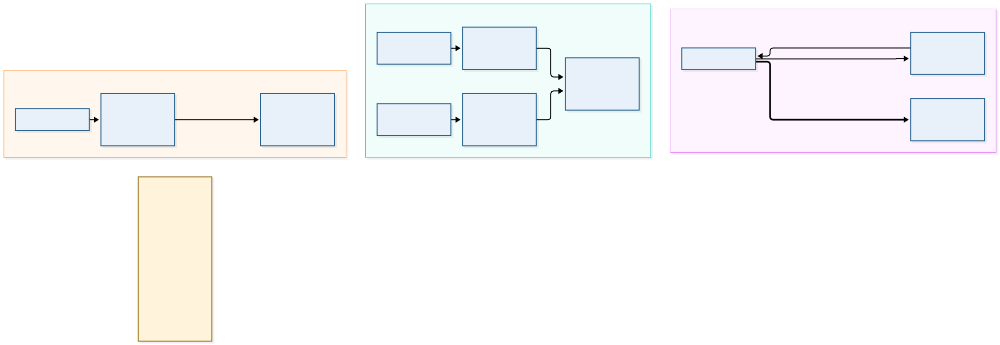

# Application delivery and security boundaries

*These are comparison lanes. Traffic Manager, the root App Gateway/LB scenario, and the independent Front Door example are not implicitly chained together.*

The root has a Standard internal load balancer and optional WAF_v2 Application Gateway. Match backend addresses, ports, probe path and guest service before expecting health. HTTPS references require a real certificate secret and suitable identity access; HTTP-only teaching settings are not equivalent to end-to-end TLS.

The [Front Door example](../../examples/front-door-private-origin/README.md) uses Premium for a Private Link origin, with approval as a manual dependency. Its public frontend remains a public web entry point. The [Traffic Manager example](../../examples/traffic-manager/README.md) teaches DNS routing with separate regional endpoints.

Use WAF policy mode and rules as an application-security decision. A WAF allow or block is different from a failed origin health probe. [Delivery curriculum](../domains/03-delivery.md) · [Edge exercise](../scenarios/edge-services.md)
