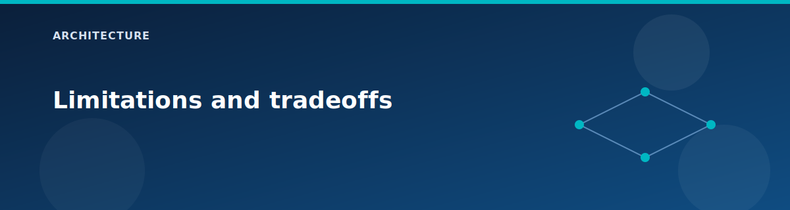

# Limitations and tradeoffs

  

This lab is optimized for learning and repeatable builds. The items below are intentional tradeoffs to keep the environment small and understandable.

## Architectural constraints

- Single region and single vHub.
- Single Terraform state file and single root module.
- No multi-subscription or multi-tenant support.

## Routing constraints

- Spoke1 cannot connect to vHub when Route Server is enabled.
- VNet peering is non-transitive; no gateway transit is configured.
- No custom route tables are defined in this lab.

## Security tradeoffs

- NSG rules are permissive to simplify lab testing.
- Firewall policy allows broad outbound traffic.
- VM admin credentials are stored in `terraform.tfvars` by default.

## Operations tradeoffs

- State is local by default.
- Diagnostics settings are not wired to Log Analytics.
- No Azure Policy or RBAC beyond subscription permissions.

## Extension ideas

- Add remote state in Azure Storage.
- Configure diagnostics for firewall, VPN, and vHub.
- Implement custom route tables and more restrictive NSGs.
- Add additional PaaS private endpoints and DNS zones.

## Related pages

- Hardening checklist: `reference/hardening.md`
- State guidance: `reference/state-and-secrets.md`
- [Scenario: Minimal cost lab](../scenarios/minimal-cost.md)
- [Cost model](../reference/cost-model.md)
- [Architecture overview](overview.md)
- [Feature matrix](../reference/feature-matrix.md)

