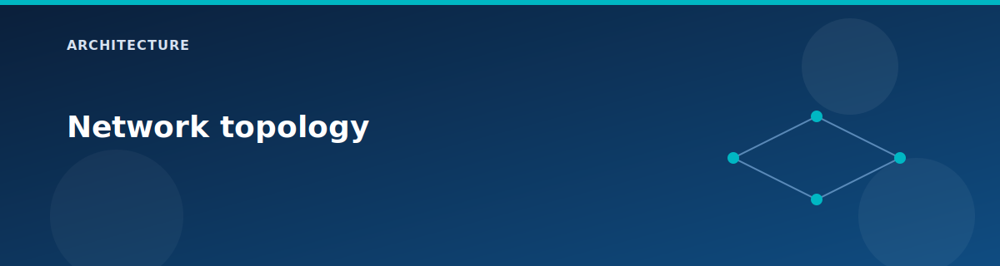

# Network topology

  

This lab uses one vHub, two spokes, and an optional on-premises simulation VNet. Address spaces and subnets are defined in `locals.tf` so the topology can be reviewed without opening the Azure portal.

## Address spaces

| Network | CIDR | Purpose |
|---------|------|---------|
| Virtual Hub | 10.10.0.0/23 | vWAN regional hub. |
| Spoke1 | 10.1.0.0/16 | Route Server, DNS resolver, NVA, edge services. |
| Spoke2 | 10.2.0.0/16 | Standard vHub connected spoke. |
| OnPrem | 192.168.0.0/16 | Simulated on-premises (optional). |

## Spoke1 subnet map

| Subnet | CIDR | Notes |
|--------|------|-------|
| Workload | 10.1.1.0/24 | Windows workload VMs, ILB backend. |
| AppGwSubnet | 10.1.2.0/24 | Application Gateway (optional). |
| AzureBastionSubnet | 10.1.3.0/26 | Bastion host (optional). |
| PrivateEndpointSubnet | 10.1.4.0/24 | Storage private endpoint; policies disabled. |
| DnsResolverInbound | 10.1.5.0/28 | DNS resolver inbound endpoint (delegated). |
| DnsResolverOutbound | 10.1.5.16/28 | DNS resolver outbound endpoint (delegated). |
| LoadBalancerSubnet | 10.1.6.0/24 | Internal Load Balancer. |
| RouteServerSubnet | 10.1.7.0/27 | Azure Route Server. |
| NvaSubnet | 10.1.8.0/24 | RRAS NVA VM (10.1.8.10). |

## Spoke2 subnet map

| Subnet | CIDR | Notes |
|--------|------|-------|
| Workload | 10.2.1.0/24 | Workload VM; Storage service endpoint enabled. |

## OnPrem subnet map

| Subnet | CIDR | Notes |
|--------|------|-------|
| GatewaySubnet | 192.168.0.0/27 | VPN gateway (optional). |
| Default | 192.168.1.0/24 | Workload VM. |
| NvaSubnet | 192.168.2.0/24 | RRAS NVA VM (192.168.2.10). |

## Connectivity matrix (high level)

| From | To | Connectivity | Notes |
|------|----|--------------|-------|
| Spoke2 | vHub | Yes (when vWAN enabled) | vHub connection with internet security enabled. |
| Spoke1 | vHub | Conditional | Disabled when Route Server is enabled. |
| Spoke1 | Spoke2 | Conditional | Peered when Route Server is enabled. |
| OnPrem | vHub | Conditional | Requires `deploy.vpn = true`. |
| OnPrem | Spoke2 | Indirect | Via vHub when VPN enabled. |

## Routing notes

- vHub connections are created with `internet_security_enabled = true`.
- When Azure Firewall is enabled, routing intent steers Internet and private traffic through the firewall.
- VNet peering in this lab does not use gateway transit or remote gateways.

## Related pages

- Spokes and peerings: `architecture/spokes-and-peerings.md`
- Routing deep dive: `architecture/routing-and-bgp.md`
- Traffic flow examples: `architecture/traffic-flows.md`
- [vWAN and vHub](vwan-and-vhub.md)
- [Scenario: Virtual WAN basics](../scenarios/vwan-basics.md)

