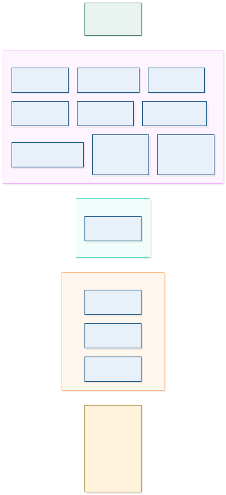

# Address allocation and service subnets

*These are the default root CIDRs. The implementation derives subnet prefixes from the selected VNet address space; the diagram is not a discovered Azure inventory.*

| Network | Default | Subnet allocation |
|---|---|---|
| vHub | 10.10.0.0/23 | Managed virtual hub; not a customer VNet |
| Spoke1 | 10.1.0.0/16 | Workload 10.1.1.0/24; AppGw 10.1.2.0/24; Bastion 10.1.3.0/26 |
| Spoke1 service subnets | Within 10.1.0.0/16 | Private Endpoint 10.1.4.0/24; DNS inbound 10.1.5.0/28; DNS outbound 10.1.5.16/28 |
| Spoke1 routing | Within 10.1.0.0/16 | LB frontend 10.1.6.0/24; RouteServerSubnet 10.1.7.0/27; NVA 10.1.8.0/24 |
| Spoke2 | 10.2.0.0/16 | Workload 10.2.1.0/24 |
| Azure-hosted branch | 192.168.0.0/16 | GatewaySubnet 192.168.0.0/27; Default 192.168.1.0/24; NVA 192.168.2.0/24 |

Record a subnet's purpose, delegation, NSG, route table, endpoint policy, and outbound method. Dedicated service subnets must remain dedicated. DNS endpoints delegate to `Microsoft.Network/dnsResolvers`; their names in this repository are conventions. `AzureBastionSubnet`, `GatewaySubnet`, and `RouteServerSubnet` have platform significance.

An address block being reserved does not enable its paid service. For example, RouteServerSubnet can exist without a Route Server instance. Avoid overlapping root/example/real-branch address spaces if a future design connects them.

For custom address inputs, verify every generated subnet and fixed host offset against [locals.tf](../../locals.tf). A valid CIDR string alone does not prove a usable or nonoverlapping topology. The [minimal exercise](../scenarios/minimal-cost.md) asks you to create that ledger.
