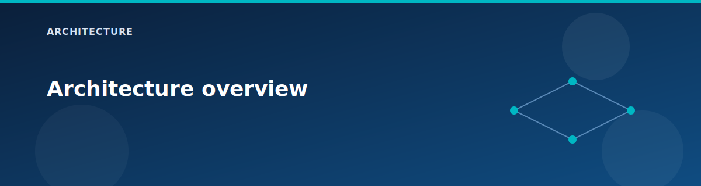

# Architecture overview

  

Azure Network Lab deploys a vWAN-centric topology for AZ-700 practice. The lab is intentionally compact but includes the core building blocks you would see in real enterprise networks: a secured hub, hub-and-spoke routing, optional site-to-site VPN, BGP route injection, and private DNS/Private Link.

## Design goals

- Teach vWAN and hub routing concepts with real infrastructure.
- Provide hands-on BGP exposure (Route Server and VPN).
- Include private DNS and private endpoints to practice name resolution.
- Keep the footprint small enough for labs and training.

## Non-goals

- Multi-region or multi-hub architectures.
- Production-grade security posture or strict least privilege.
- Advanced routing policies (custom route tables, forced tunneling, SD-WAN).

## Core components

| Component | Purpose | Notes |
|-----------|---------|-------|
| Virtual WAN | Global transit fabric | Standard vWAN with branch-to-branch enabled. |
| Virtual Hub | Regional hub | /23 prefix, Standard SKU. |
| Secured Hub | Central inspection | Azure Firewall with routing intent (optional). |
| vHub VPN Gateway | S2S termination | BGP enabled, ASN 65515 (optional). |
| Spoke VNets | Workload isolation | Spoke1, Spoke2, and OnPrem simulation. |
| Route Server | BGP route exchange | Spoke1 Route Server with NVA peer (optional). |
| DNS Private Resolver | Private DNS resolution | Inbound/outbound endpoints in Spoke1 (optional). |
| Private DNS zones | Private name resolution | `lab.internal` and `privatelink.blob.core.windows.net`. |
| Private Endpoint | Private PaaS access | Storage blob endpoint in Spoke1 (optional). |
| Windows VMs | Workload + NVA | Server 2022 Core, optional RRAS NVA. |

## Default lab profile

The repository ships with a lab profile in `terraform.tfvars`. Treat it as the current, editable profile rather than a hard-coded default. The values below mirror that file and can be changed as needed:

- `deploy.vwan`: true
- `deploy.vhub_firewall`: true
- `deploy.vpn`: false
- `deploy.route_server`: true
- `deploy.dns_resolver`: true
- `deploy.private_dns_zones`: true
- `deploy.private_endpoint`: true
- `deploy.application_gateway`: false
- `deploy.load_balancer`: true
- `deploy.nat_gateway`: true
- `deploy.bastion`: false
- `deploy.spoke1_vms`: true
- `deploy.spoke2_vms`: true
- `deploy.onprem_vms`: false
- `deploy.nvas`: true

## Key behaviors and constraints

- Spoke1 is not connected to vHub when Route Server is enabled (Azure limitation).
- Spoke1 and Spoke2 peer directly when Route Server is enabled.
- Storage account public access is disabled; access is via private endpoint only.
- The lab uses a single Azure region and a single Terraform state file.

## Related pages

- Core fabric: `architecture/vwan-and-vhub.md`
- Spokes and peering: `architecture/spokes-and-peerings.md`
- Firewall: `architecture/firewall-and-routing-intent.md`
- VPN: `architecture/vpn-and-hybrid.md`
- Route Server: `architecture/route-server-and-nva.md`
- Edge services: `architecture/edge-services.md`
- [Network topology](network-topology.md)
- [Routing and BGP](routing-and-bgp.md)
- [Security model](security-model.md)
- [Configuration flow](configuration-flow.md)

