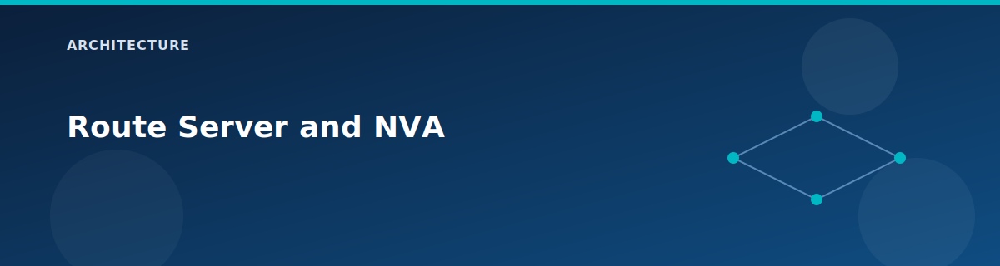

# Route Server and NVA

<p align="center">
  
</p>


This page explains how Azure Route Server is paired with a Windows RRAS NVA to provide BGP route exchange in the lab.

## Route Server

Created by `modules/route-server`:

- Standard SKU.
- Uses a Standard public IP with zone redundancy.
- Branch-to-branch traffic enabled.
- BGP peers are defined by `locals.route_server_bgp_connections`.

Default BGP peer:

- Peer IP: 10.1.8.10 (Spoke1 NVA).
- Peer ASN: 65501.

## NVA VM (RRAS)

Created by `modules/vm-windows-nva`:

- Windows Server 2022 Datacenter Core.
- Static IP (Spoke1 NVA: 10.1.8.10).
- IP forwarding enabled on the NIC.
- Custom Script extension installs RRAS and configures BGP.

### RRAS startup behavior

The extension creates a scheduled task that runs at startup:

- Installs RemoteAccess and Routing features.
- Ensures the RemoteAccess service is running.
- Configures BGP router and peers.
- Adds custom routes if specified.

Logs are written to `C:\rras-config.log`.

## BGP behavior

- BGP peers are created only when Route Server IPs are available.
- Default advertised routes are provided by `locals.vm_nva.advertised_routes`.
- Route Server ASN is 65515; NVA ASN is 65501.

## Validation commands

```bash
az network routeserver show -g rg-<prefix> -n rs-<prefix> -o table
az network routeserver peering list -g rg-<prefix> --routeserver rs-<prefix> -o table

az vm run-command invoke -g rg-<prefix> -n vm-spoke1-nva \
  --command-id RunPowerShellScript \
  --scripts "Get-BgpPeer | Format-Table Name,PeerIPAddress,PeerASN,State,SessionState"
```

## Related pages

- Routing overview: `architecture/routing-and-bgp.md`
- Scenario: `scenarios/route-server-bgp.md`
- [Scenario: Route Server and NVA (BGP)](../scenarios/route-server-bgp.md)
- [Route validation](../testing/route-validation.md)
- [ASNs and IPs](../reference/asn-and-ips.md)

