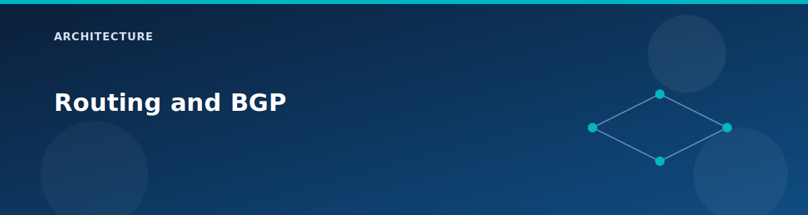

# Routing and BGP

<p align="center">
  
</p>


This lab exercises two routing planes: vWAN/vHub routing for hub-and-spoke traffic and BGP for dynamic route exchange. The goal is to make the routing behavior visible and testable without adding complex custom route tables.

## Routing planes

- VNet system routes: default Azure routing inside each VNet.
- vWAN/vHub transit: hub connections that move traffic between spokes.
- BGP: dynamic routes from Route Server and VPN gateways.

## BGP ASNs and peers

| Component | ASN | Notes |
|-----------|-----|------|
| vHub VPN Gateway | 65515 | Configured in `modules/vhub-vpn-gateway`. |
| Azure Route Server | 65515 | Azure default for Route Server. |
| Spoke1 NVA (RRAS) | 65501 | Configured in `locals.tf`. |
| OnPrem VPN Gateway | 65510 | Configured in `main.tf`. |

## Route Server path (Spoke1)

- Route Server lives in `RouteServerSubnet` in Spoke1.
- RRAS NVA (10.1.8.10) peers with the Route Server IPs.
- The NVA advertises custom routes (default: `10.100.0.0/16`).
- Branch-to-branch traffic is enabled to allow BGP route exchange.

## VPN path (OnPrem to vHub)

- vHub VPN Gateway terminates the site-to-site connection.
- OnPrem VNet hosts a VPN gateway (route-based, BGP enabled).
- The VPN connection uses IKEv2 and BGP for dynamic routing.

## Propagation expectations

- When VPN is enabled, on-prem address space is advertised into vHub.
- When Route Server is enabled, NVA routes appear on Route Server peers.
- Spoke2 learns routes via the vHub connection when vWAN is enabled.

## Validation commands

```bash
# Route Server and peers
az network routeserver show -g rg-<prefix> -n rs-<prefix> -o table
az network routeserver peering list -g rg-<prefix> --routeserver rs-<prefix> -o table

# vHub VPN Gateway BGP settings
az network vhub gateway show -g rg-<prefix> -n vpngw-vhub-<prefix> -o table
```

## Constraints to remember

- Spoke1 cannot connect to vHub when Route Server is enabled.
- VNet peering is non-transitive; there is no gateway transit in this lab.

## Related pages

- Route Server details: `architecture/route-server-and-nva.md`
- VPN details: `architecture/vpn-and-hybrid.md`
- Traffic flows: `architecture/traffic-flows.md`
- VPN scenario: `scenarios/vpn-bgp.md`
- Route Server scenario: `scenarios/route-server-bgp.md`
- [vWAN and vHub](vwan-and-vhub.md)
- [Scenario: VPN and BGP](../scenarios/vpn-bgp.md)
- [ASNs and IPs](../reference/asn-and-ips.md)

