# Forward paths, return paths and egress

*Each row is a separate configuration case. Return arrows are deliberate. The diagram is not a claim that all three paths exist in one profile.*

For every proposed flow, answer:

1. Which address did DNS return?
2. Which next hop is selected for that destination?
3. Which device translates source addresses?
4. Which policy evaluates the packet?
5. How does the response find the translated or original source?
6. Which log and timestamp could prove the path?

The minimal profile does not provide a general Internet egress appliance. The Route Server/application profiles select explicit NAT for their compute paths. Spoke1 associates workload/NVA subnets; enabled branch or eligible Spoke2 compute uses separate NAT services. The secured hub uses its own Firewall path. Do not assume a NAT association wins over a UDR pointing to a virtual appliance.

The default outbound access platform change reinforces explicit egress design: new VNets created through post-31-March-2026 APIs default private; it is not a blanket disconnection of every existing VNet. [Microsoft guidance](https://learn.microsoft.com/en-us/azure/virtual-network/ip-services/default-outbound-access)

The [route checks](../testing/route-validation.md) and [ports table](../reference/ports-and-protocols.md) describe future evidence. No routes or traffic were queried for this update.
