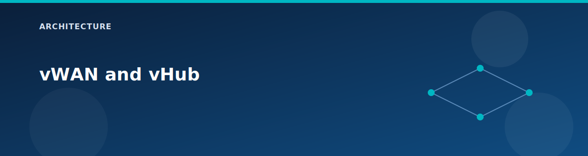

# vWAN and vHub

  

This page focuses on the vWAN fabric and vHub services created by the lab. These resources form the core transit layer for hub-and-spoke routing.

## Virtual WAN (vWAN)

The vWAN is created by `modules/vwan` with the following key settings:

- `type = "Standard"`
- `allow_branch_to_branch_traffic = true`
- `disable_vpn_encryption = false`
- `office365_local_breakout_category = "None"`

These defaults are optimized for training and lab flexibility.

## Virtual Hub (vHub)

The vHub is created by `modules/vhub`:

- Standard SKU.
- Address prefix comes from `var.vhub_address_prefix` (default /23).
- Tied directly to the vWAN ID.

## vHub connections

Spoke VNets connect to the hub using `modules/vhub-connection`:

- Connections are created from `locals.vhub_connections_enabled`.
- `internet_security_enabled` is set from locals (true in the lab profile).
- Spoke1 connection is disabled when Route Server is enabled.

## vHub VPN gateway

If `deploy.vpn = true`, the lab creates a vHub VPN gateway:

- Scale unit defaults to 1.
- BGP ASN is 65515.
- Used by the vWAN VPN site connection.

## Outputs to watch

- `vwan_id`
- `vhub_id`
- `route_server_virtual_router_ips` (if Route Server enabled)

## Related pages

- Routing behaviors: `architecture/routing-and-bgp.md`
- VPN details: `architecture/vpn-and-hybrid.md`
- Connectivity tests: `testing/lab-testing-guide.md`
- [Network topology](network-topology.md)
- [Firewall and routing intent](firewall-and-routing-intent.md)
- [Scenario: Virtual WAN basics](../scenarios/vwan-basics.md)

