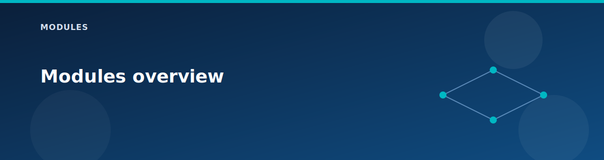

# Modules overview

  

Modules are thin, single-responsibility building blocks. The root module controls feature flags and wiring; modules focus on a specific resource group of Azure services.

## Conventions

- All modules accept a shared `ctx` object (project, location, tags).
- Provider configuration lives in the root (`providers.tf`).
- Naming is passed in from the root; modules do not invent names.
- Optional resources are enabled with `count` or filtered `for_each` maps.

## Module map

| Category | Modules | Notes |
|----------|---------|-------|
| Foundation | `resource-group`, `tags`, `log-analytics` | Core lab scaffolding. |
| WAN/Hub | `vwan`, `vhub`, `vhub-connection`, `vhub-firewall`, `vhub-vpn-gateway` | vWAN fabric and hub services. |
| VNets | `vnet`, `vnet-peering`, `nsg` | Spoke VNets, peering, and NSGs. |
| Hybrid | `vpn-gateway`, `vpn-site`, `vpn-connection`, `local-network-gateway` | S2S VPN and on-prem simulation. |
| Routing | `route-server` | BGP with NVA peers. |
| DNS | `dns-private-resolver`, `private-dns-zone` | Private DNS services. |
| Edge | `nat-gateway`, `load-balancer`, `application-gateway`, `bastion` | Per-spoke edge services. |
| Compute | `vm-windows`, `vm-windows-nva` | Workload VMs and RRAS NVA. |
| PaaS | `storage-account`, `private-endpoint` | Storage + private endpoint. |

## Design notes

- Modules are intentionally small so you can read the Azure resource definitions directly.
- All modules return the key IDs and IPs needed by the root module.
- The root module enforces ordering via `depends_on` only where necessary.

## Next

- Networking details: `modules/networking.md`
- Compute details: `modules/compute.md`
- Security details: `modules/security.md`

## Related pages

- [Architecture overview](../architecture/overview.md)
- [Terraform patterns](../reference/terraform-patterns.md)
