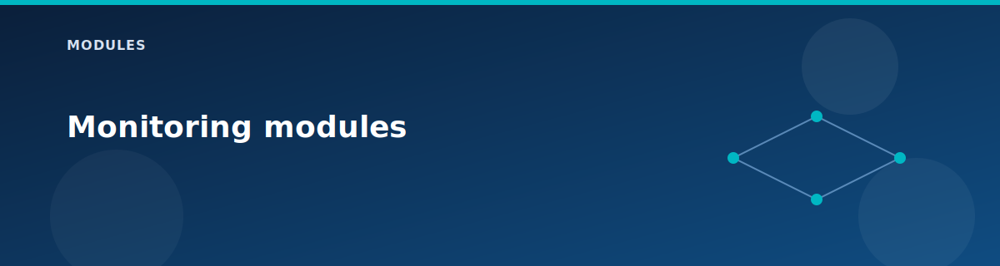

# Monitoring modules

  

## log-analytics

Creates a Log Analytics workspace for diagnostics and future extensions. The root module does not currently wire diagnostic settings to it, so treat it as a placeholder for lab expansion.

## Extension ideas

- Enable diagnostics for vHub, Firewall, and VPN gateways.
- Forward NSG flow logs to the workspace.

## Related pages

- [Lab testing guide](../testing/lab-testing-guide.md)
- [Outputs reference](../reference/outputs.md)
- [CLI cheat sheet](../reference/cli-cheatsheet.md)
- [Architecture overview](../architecture/overview.md)
