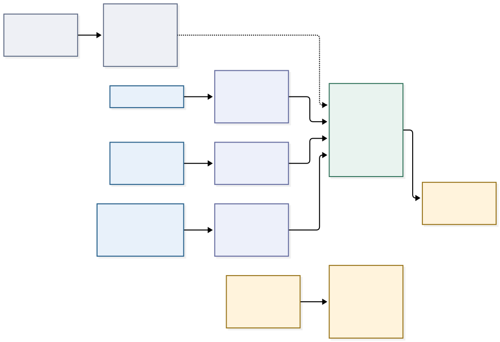

# Monitoring configuration and interpretation



*Source checks describe intended configuration. Flow records, resource diagnostics and probes describe different observations. Azure evidence remains NOT RUN.*

All shipped profiles leave `deploy.monitoring` false. A Log Analytics workspace alone does not enable diagnostics. To opt in later, explicitly select both Log Analytics and monitoring and configure [the monitoring object](../reference/variables.md#monitoring-settings).

The module reuses an **existing regional Network Watcher**. It owns the lab's VNet flow logs and optional Connection Monitor child resources under that watcher, but not the watcher or its shared resource group. Record those child IDs for cleanup.

VNet flow logging creates dedicated storage with service-managed write requirements: public endpoint enabled, network default Deny, trusted Azure service bypass, shared-key support. This differs deliberately from private-only sample Blob storage. Do not copy one account's settings to the other without checking service requirements.

Diagnostics target selected Firewall, gateway and delivery resources. Connection Monitor uses a configured Windows VM/agent and TCP/443 destination; Traffic Analytics is separately opt-in and costs extra.

## Synthetic record exercise

This simplified table is **invented teaching data, not native VNet flow-log JSON**:

| Time | Source | Destination | Transport | Predicted rule outcome |
|---|---|---|---|---|
| 12:00:00Z | 10.1.1.10 | 10.2.1.10:80 | TCP | Allowed |
| 12:00:05Z | 10.1.1.10 | 10.2.1.10:3389 | TCP | Denied by scoped administration policy |

Ask which interface logged the flow, which rule evaluated it, whether responses exist, and whether the application returned data. Use the [actual VNet flow schema](https://learn.microsoft.com/en-us/azure/network-watcher/vnet-flow-logs-overview) when parsing real records.

For a future AzureDiagnostics destination, this starting query inspects Firewall categories:

```kusto
AzureDiagnostics
| where TimeGenerated > ago(30m)
| where ResourceProvider =~ "MICROSOFT.NETWORK"
| where Category startswith "AzureFirewall"
| project TimeGenerated, Category, msg_s
```

Adjust for the actual configured table/schema; an empty query is not proof of no traffic. Correlate source, destination and UTC window. No query was run. [Evidence matrix](../testing/test-matrix.md)
