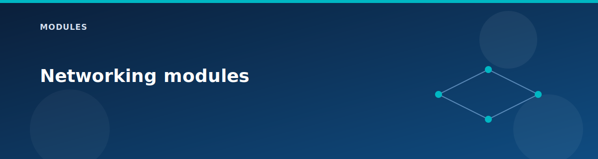

# Networking modules

  

These modules are the core of the lab. They map directly to Azure networking services and expose the minimum inputs needed for a predictable build.

## Virtual WAN and hub

### vwan
- Creates a Standard vWAN with branch-to-branch traffic enabled.
- No custom route tables are defined in this module.

### vhub
- Creates a Standard vHub with an explicit address prefix (default /23).

### vhub-connection
- Connects VNets to the vHub.
- `internet_security_enabled` controls firewall inspection.

### vhub-firewall
- Deploys Azure Firewall (hub SKU) with a firewall policy.
- Default rule sets allow HTTP/HTTPS and broad outbound lab traffic.
- Adds routing intent for Internet and private traffic.

### vhub-vpn-gateway
- Creates a vHub VPN gateway with BGP enabled (ASN 65515).
- Scale unit is configurable from the root module.

## Spoke VNets and routing

### vnet
- Creates VNets and a subnet map with optional delegation.
- Supports service endpoints and private endpoint policy settings.

### nsg
- Creates NSGs and rules from a map.
- Associates NSGs to multiple subnets in a single module call.

### vnet-peering
- Sets up peering between spokes.
- `allow_forwarded_traffic` enabled; no gateway transit by default.

### route-server
- Standard Route Server with a zonal public IP.
- BGP peers are provided as a map for `for_each`.

## VPN and hybrid connectivity

### vpn-gateway
- Route-based VPN gateway with Standard public IP.
- Supports BGP when enabled in the root module.

### local-network-gateway
- Represents the vHub gateway on the on-prem side.
- BGP settings are optional and conditional.

### vpn-site
- Defines a vWAN VPN site and a VPN gateway connection.
- BGP peering address is passed from the on-prem gateway.

### vpn-connection
- Creates an IPsec/IKEv2 connection between on-prem and vHub.

## Edge services

### nat-gateway
- Standard NAT gateway with a zonal public IP (zone 1).
- Associated to the Spoke1 Workload subnet.

### load-balancer
- Standard internal LB with HTTP probe on port 80.
- Simple HTTP load-balancing rule on port 80.

### application-gateway
- WAF v2 App Gateway with HTTP listener on port 80.
- WAF is in Detection mode by default.

### bastion
- Azure Bastion with a public IP.
- Features depend on SKU (Basic vs Standard).

## DNS

### dns-private-resolver
- Creates a Private DNS Resolver with inbound and outbound endpoints.
- Subnets must be delegated to Microsoft.Network/dnsResolvers.

### private-dns-zone
- Creates private DNS zones and links VNets.
- Supports auto-registration for `lab.internal`.

## Related pages

- [Network topology](../architecture/network-topology.md)
- [vWAN and vHub](../architecture/vwan-and-vhub.md)
- [Variables reference](../reference/variables.md)
- [Ports and protocols](../reference/ports-and-protocols.md)
