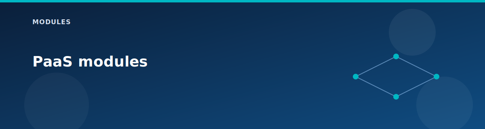

# PaaS modules

  

## storage-account

- Standard LRS storage account with TLS 1.2 enforced.
- Public network access is disabled by default.
- Name uses a deterministic prefix plus a random suffix.

## private-endpoint

- Creates a private endpoint for the storage account (blob).
- Adds a private DNS zone group when zone IDs are provided.

## Notes

- Public access can only be enabled if explicitly allowed.
- Private endpoints live in the Spoke1 `PrivateEndpointSubnet`.

## Related pages

- [Scenario: Edge services (LB, NAT, App Gateway, Bastion)](../scenarios/edge-services.md)
- [Defaults and SKUs](../reference/defaults-and-skus.md)
- [Feature matrix](../reference/feature-matrix.md)
- [Architecture overview](../architecture/overview.md)
