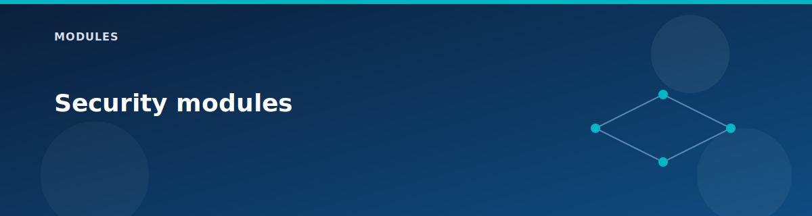

# Security modules

  

## tags

- Enforces required tags: Environment, Project, ManagedBy, Purpose.
- Merges defaults with user-provided tags.

## vhub-firewall

- Deploys Azure Firewall in vHub with a firewall policy.
- Policy allows lab traffic for HTTP, HTTPS, and ICMP.
- Routing intent sends Internet and private traffic through firewall.

## nsg

- Builds NSG rules from a map of rule definitions.
- Attaches NSGs to multiple subnets in one module call.

## Related pages

- Security model: `architecture/security-model.md`
- Hardening: `reference/hardening.md`
- [Security model](../architecture/security-model.md)
- [Firewall and routing intent](../architecture/firewall-and-routing-intent.md)
- [Hardening checklist](../reference/hardening.md)
- [Ports and protocols](../reference/ports-and-protocols.md)

