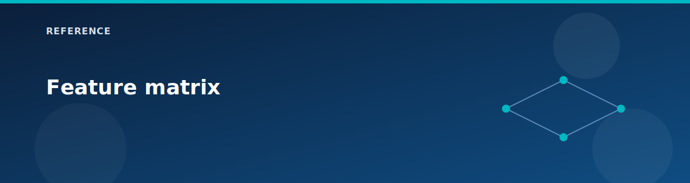

# Feature matrix

  

This table maps `deploy` flags to the modules and resources they enable.

| Deploy flag | Modules | Key resources | Notes |
|-------------|---------|---------------|-------|
| `deploy.vwan` | `vwan`, `vhub`, `vhub-connection` | Virtual WAN, vHub, vHub connections | Base fabric for hub-and-spoke. |
| `deploy.vhub_firewall` | `vhub-firewall` | Azure Firewall, firewall policy, routing intent | Requires `deploy.vwan = true`. |
| `deploy.vpn` | `vhub-vpn-gateway`, `vpn-gateway`, `vpn-site`, `local-network-gateway`, `vpn-connection` | vHub VPN GW, on-prem VPN GW, VPN site/connection | Requires `deploy.vwan = true`. |
| `deploy.route_server` | `route-server`, `vnet-peering`, `vm-windows-nva` | Route Server, vnet peering, RRAS NVA | Disables Spoke1 vHub connection. |
| `deploy.dns_resolver` | `dns-private-resolver` | DNS Private Resolver | Requires delegated subnets in Spoke1. |
| `deploy.private_dns_zones` | `private-dns-zone` | Private DNS zones and VNet links | Required for private endpoints. |
| `deploy.private_endpoint` | `storage-account`, `private-endpoint` | Storage account + private endpoint | Best paired with DNS zones. |
| `deploy.load_balancer` | `load-balancer` | Internal load balancer | Spoke1 workload subnet. |
| `deploy.application_gateway` | `application-gateway` | WAF v2 App Gateway | Spoke1 AppGw subnet. |
| `deploy.nat_gateway` | `nat-gateway` | NAT gateway + public IP | Spoke1 workload subnet. |
| `deploy.bastion` | `bastion` | Azure Bastion host | Requires AzureBastionSubnet. |
| `deploy.spoke1_vms` | `vm-windows` | Spoke1 workload VMs | Two VMs by default. |
| `deploy.spoke2_vms` | `vm-windows` | Spoke2 workload VM | One VM by default. |
| `deploy.onprem_vms` | `vm-windows` | OnPrem workload VM | One VM by default. |
| `deploy.nvas` | `vm-windows-nva` | RRAS NVAs | OnPrem and Spoke1 NVAs. |

## Notes

- vHub connections are controlled by `locals.vhub_connections_enabled` to handle the Route Server constraint.
- NSGs, VNets, and resource group are always created regardless of toggles.

## Related pages

- [Lab scenarios](../scenarios/README.md)
- [Defaults and SKUs](defaults-and-skus.md)
- [Cost model](cost-model.md)
- [Variables reference](variables.md)
