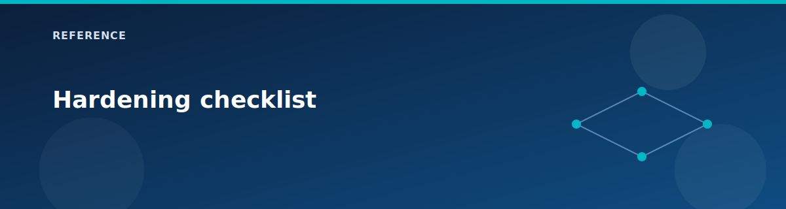

# Hardening checklist

  

These steps tighten the lab configuration without changing its core architecture. They are optional and intended for real-world practice.

## Identity and access

- Use unique, strong admin passwords per environment.
- Rotate VPN shared keys regularly.
- Restrict who can read outputs that contain IPs or secrets.

## Network security

- Limit RDP to known admin IPs or use Bastion only.
- Remove ICMP and HTTP rules when not testing.
- Replace the firewall allow-all rules with a least-privilege policy.

## PaaS protections

- Keep storage public access disabled.
- Use private endpoints for all PaaS services you add.
- Enable storage account logging and Azure Defender.

## Monitoring and logging

- Send firewall diagnostics to Log Analytics.
- Enable NSG flow logs for workload subnets.
- Capture VPN gateway diagnostics for connection analysis.

## Terraform and state

- Use remote state with encryption and blob versioning.
- Store secrets in a vault or environment variables, not in git.
- Enable state locking and soft-delete for rollback.

## Documentation

- Update `reference/current-config.md` after each profile change.
- Document any custom routes or NSG rules you add.

## Related pages

- [Security model](../architecture/security-model.md)
- [State and secrets](state-and-secrets.md)
- [Ports and protocols](ports-and-protocols.md)
- [Troubleshooting](../testing/troubleshooting.md)
