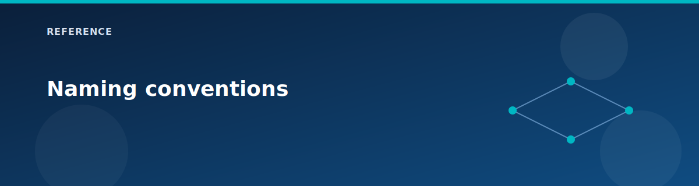

# Naming conventions

<p align="center">
  
</p>


Resource names are derived from `ctx.project` using a lowercase prefix:

```hcl
local.prefix = lower(var.ctx.project)
```

## Common patterns

| Resource | Pattern | Example |
|----------|---------|---------|
| Resource group | `rg-<prefix>` | `rg-az700-lab` |
| Virtual WAN | `vwan-<prefix>` | `vwan-az700-lab` |
| Virtual Hub | `vhub-<prefix>` | `vhub-az700-lab` |
| Firewall | `fw-vhub-<prefix>` | `fw-vhub-az700-lab` |
| Firewall policy | `fwpol-<prefix>` | `fwpol-az700-lab` |
| VPN GW (vHub) | `vpngw-vhub-<prefix>` | `vpngw-vhub-az700-lab` |
| VPN GW (onprem) | `vpngw-onprem-<prefix>` | `vpngw-onprem-az700-lab` |
| Route Server | `rs-<prefix>` | `rs-az700-lab` |
| DNS resolver | `dnspr-<prefix>` | `dnspr-az700-lab` |
| Bastion | `bas-<prefix>` | `bas-az700-lab` |
| NAT Gateway | `nat-<prefix>` | `nat-az700-lab` |
| App Gateway | `appgw-<prefix>` | `appgw-az700-lab` |
| Load Balancer | `ilb-<prefix>` | `ilb-az700-lab` |
| VNet (spoke1) | `vnet-spoke1-<prefix>` | `vnet-spoke1-az700-lab` |
| VNet (spoke2) | `vnet-spoke2-<prefix>` | `vnet-spoke2-az700-lab` |
| VNet (onprem) | `vnet-onprem-<prefix>` | `vnet-onprem-az700-lab` |
| VMs | `vm-<role>` | `vm-spoke1-1`, `vm-spoke1-nva` |

## Storage account naming

Storage account names must be lowercase, alphanumeric, and <= 24 characters. The lab uses a prefix derived from the `Project` tag and appends a random suffix:

```hcl
storage_account_name_prefix = "st" + lower(replace(ProjectTag, "-", ""))
```

Example: `staz700` + random 8 characters.

## Tag requirements

Required tags are enforced by the tags module:

- Environment
- Project
- ManagedBy
- Purpose

## Related pages

- [Variables reference](variables.md)
- [Current config (lab profile)](current-config.md)
- [Glossary](glossary.md)
- [Architecture overview](../architecture/overview.md)
