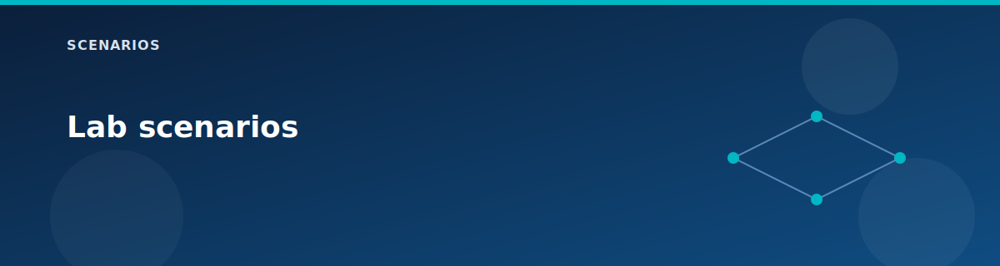

# Lab scenarios

  

Scenarios are short, focused lab paths. Each one lists the feature toggles you need, the expected outcomes, and a small set of validation commands.

## How to use scenarios

1. Set the `deploy` flags for the scenario.
2. `terraform plan` and `terraform apply`.
3. Run the validation steps in the scenario.

## Scenario list

- [Virtual WAN basics](vwan-basics.md)
- [Secured hub and firewall](secured-hub-firewall.md)
- [VPN and BGP](vpn-bgp.md)
- [Route Server and NVA (BGP)](route-server-bgp.md)
- [Private endpoints and DNS](private-endpoints-dns.md)
- [Edge services (LB, NAT, App Gateway, Bastion)](edge-services.md)
- [Minimal cost lab](minimal-cost.md)
- [Full lab build](full-lab.md)

## Tips

- Use the testing matrix to see which tests apply: `../testing/test-matrix.md`.
- For cross-component troubleshooting, use `../testing/troubleshooting.md`.
- Map scenarios to AZ-700 domains: `../reference/az-700-alignment.md`.

## Related pages

- [Architecture overview](../architecture/overview.md)
- [Lab testing guide](../testing/lab-testing-guide.md)
- [Variables reference](../reference/variables.md)
- [Feature matrix](../reference/feature-matrix.md)
