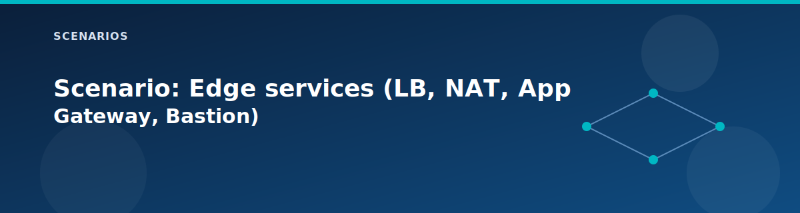

# Scenario: Edge services (LB, NAT, App Gateway, Bastion)

<p align="center">
  
</p>


## Goal

Validate optional edge services in Spoke1: internal load balancer, NAT gateway, application gateway, and Bastion.

## Required toggles

- `deploy.load_balancer = true` for ILB
- `deploy.nat_gateway = true` for NAT

## Optional toggles

- `deploy.application_gateway = true`
- `deploy.bastion = true`

## Steps

1. Deploy the lab with the desired edge services enabled.
2. Install IIS on the Spoke1 workload VMs.
3. Validate ILB HTTP path.
4. Validate outbound NAT using an external IP check.
5. (Optional) Configure App Gateway backend pool and validate HTTP.
6. (Optional) Test Bastion access.

## Commands

```bash
# Install IIS on workload VMs
az vm run-command invoke -g rg-<prefix> -n vm-spoke1-1 \
  --command-id RunPowerShellScript \
  --scripts "Install-WindowsFeature Web-Server"

az vm run-command invoke -g rg-<prefix> -n vm-spoke1-2 \
  --command-id RunPowerShellScript \
  --scripts "Install-WindowsFeature Web-Server"

# Validate ILB (replace with output)
# Test-NetConnection -ComputerName <lb_frontend_ip> -Port 80

# Validate outbound NAT (run inside VM)
# Invoke-RestMethod https://api.ipify.org
```

## Expected results

- ILB responds on port 80 when IIS is installed.
- Outbound public IP reflects the NAT gateway IP.
- App Gateway responds only after you add backend pool targets.
- Bastion DNS name is present in outputs when enabled.

## Notes

- Replace `<prefix>` with `ctx.project`.
- The App Gateway module creates an empty backend pool by default.
- Use outputs for `load_balancer_frontend_ip` and `application_gateway_public_ip`.

## Related pages

- [Edge services](../architecture/edge-services.md)
- [Defaults and SKUs](../reference/defaults-and-skus.md)
- [Security modules](../modules/security.md)
- [Component checks](../testing/component-checks.md)
