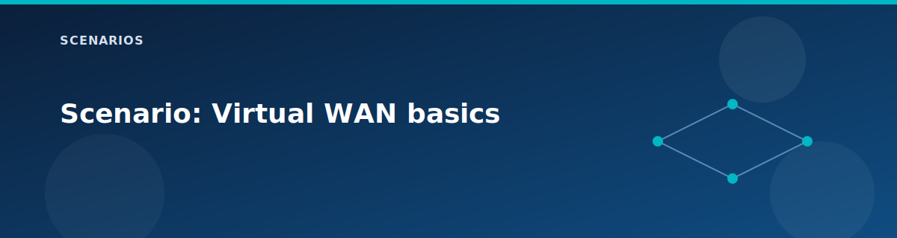

# Scenario: Virtual WAN basics

<p align="center">
  
</p>


## Goal

Validate that vWAN and vHub are deployed and that spokes connect as expected.

## What you learn

- How vWAN and vHub appear in Azure.
- How vHub connections are represented.
- How Route Server impacts Spoke1 connectivity.

## Required toggles

- `deploy.vwan = true`
- `deploy.vhub_firewall` can be true or false

## Optional toggles

- `deploy.route_server = false` if you want Spoke1 to connect to vHub.

## Steps

1. Apply the lab and capture outputs.
2. Confirm vWAN and vHub exist.
3. Verify vHub connections for spokes.

## Commands

```bash
# vWAN and vHub
az network vwan show -g rg-<prefix> -n vwan-<prefix> -o table
az network vhub show -g rg-<prefix> -n vhub-<prefix> -o table

# vHub connections
az network vhub connection list -g rg-<prefix> --vhub-name vhub-<prefix> -o table
```

## Expected results

- vWAN and vHub are in Succeeded state.
- Spoke2 is connected to vHub when vWAN is enabled.
- Spoke1 connects only when Route Server is disabled.

## Notes

- Replace `<prefix>` with `ctx.project`.
- If the vHub connection is missing, confirm `deploy.vwan` and `deploy.route_server`.

## Related pages

- [vWAN and vHub](../architecture/vwan-and-vhub.md)
- [Network topology](../architecture/network-topology.md)
- [Component checks](../testing/component-checks.md)
- [Variables reference](../reference/variables.md)
