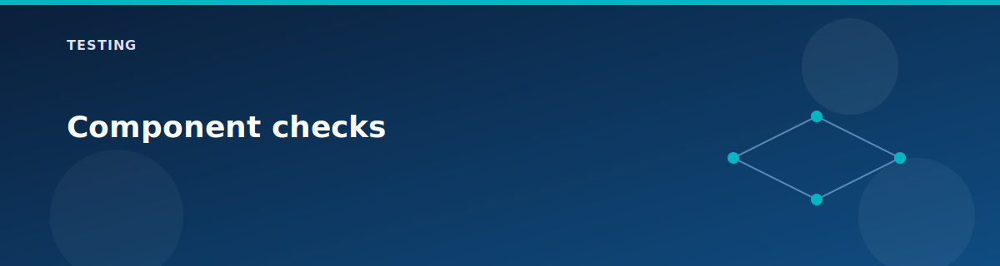

# Component checks

<p align="center">
  
</p>


This page provides focused checks for each major component. Use it when a single feature is not behaving as expected.

## Resource group inventory

```bash
az resource list -g rg-<prefix> -o table
```

Expected:

- vWAN, vHub, VNets, and enabled optional services appear.

## VNets and subnets

```bash
az network vnet list -g rg-<prefix> -o table
az network vnet subnet list -g rg-<prefix> --vnet-name vnet-spoke1-<prefix> -o table
```

## VNet peering

```bash
az network vnet peering list -g rg-<prefix> --vnet-name vnet-spoke1-<prefix> -o table
```

Expected:

- Spoke1 <-> Spoke2 peering exists when Route Server is enabled.

## NSG rules

```bash
az network nsg rule list -g rg-<prefix> --nsg-name nsg-spoke1-<prefix> -o table
```

Expected:

- RDP, HTTP, HTTPS, and ICMP rules are present.

## Load balancer

```bash
az network lb show -g rg-<prefix> -n ilb-<prefix> -o table
```

## NAT gateway

```bash
az network nat gateway show -g rg-<prefix> -n nat-<prefix> -o table
```

## Application Gateway

```bash
az network application-gateway show -g rg-<prefix> -n appgw-<prefix> -o table
```

## Bastion

```bash
az network bastion show -g rg-<prefix> -n bas-<prefix> -o table
```

## Storage + private endpoint

```bash
az storage account list -g rg-<prefix> -o table
az network private-endpoint list -g rg-<prefix> -o table
```

## Next

- Route validation: `route-validation.md`
- DNS validation: `dns-validation.md`

## Related pages

- [Lab testing guide](lab-testing-guide.md)
- [Troubleshooting](troubleshooting.md)
- [Scenario: Virtual WAN basics](../scenarios/vwan-basics.md)
- [CLI cheat sheet](../reference/cli-cheatsheet.md)
