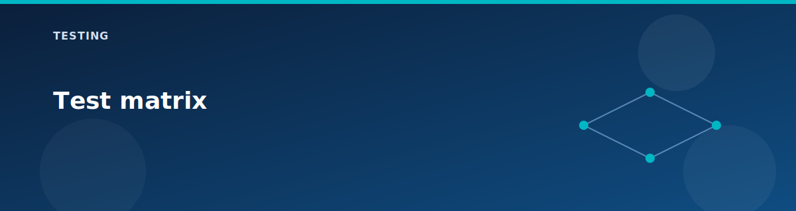

# Test matrix

  

Use this matrix to pick tests based on enabled features. Each row lists the minimum toggle and a quick validation command.

| Component | Toggle | Validation |
|-----------|--------|------------|
| vWAN | `deploy.vwan` | `az network vwan show -g rg-<prefix> -n vwan-<prefix>` |
| vHub | `deploy.vwan` | `az network vhub show -g rg-<prefix> -n vhub-<prefix>` |
| vHub connection | `deploy.vwan` | `az network vhub connection list -g rg-<prefix> --vhub-name vhub-<prefix>` |
| Firewall | `deploy.vhub_firewall` | `az network firewall show -g rg-<prefix> -n fw-vhub-<prefix>` |
| VPN gateways | `deploy.vpn` | `az network vnet-gateway show -g rg-<prefix> -n vpngw-onprem-<prefix>` |
| VPN connection | `deploy.vpn` | `az network vpn-connection show -g rg-<prefix> -n conn-onprem-to-vhub-<prefix>` |
| Route Server | `deploy.route_server` | `az network routeserver show -g rg-<prefix> -n rs-<prefix>` |
| BGP peers | `deploy.route_server` | `az network routeserver peering list -g rg-<prefix> --routeserver rs-<prefix>` |
| DNS zones | `deploy.private_dns_zones` | `az network private-dns zone list -g rg-<prefix>` |
| DNS resolver | `deploy.dns_resolver` | `az resource list -g rg-<prefix> --resource-type Microsoft.Network/dnsResolvers` |
| Private endpoint | `deploy.private_endpoint` | `az network private-endpoint list -g rg-<prefix>` |
| ILB | `deploy.load_balancer` | `Test-NetConnection <lb_ip> -Port 80` |
| NAT gateway | `deploy.nat_gateway` | `Invoke-RestMethod https://api.ipify.org` (from VM) |
| App Gateway | `deploy.application_gateway` | `curl http://<appgw_ip>` (after backend config) |
| Bastion | `deploy.bastion` | Bastion DNS name in outputs |

## Notes

- Replace `<prefix>` with `ctx.project`.
- Replace placeholders with outputs from `terraform output`.
- Some tests require running commands inside a VM via RunCommand.
- Use `testing/troubleshooting.md` for common failure patterns.

## Related pages

- [Lab testing guide](lab-testing-guide.md)
- [Lab scenarios](../scenarios/README.md)
- [Feature matrix](../reference/feature-matrix.md)
- [Outputs reference](../reference/outputs.md)
